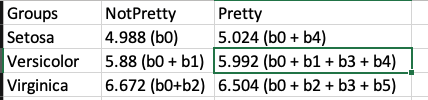
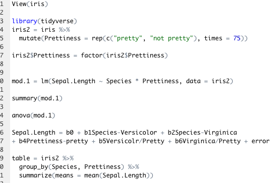

## Week 1

#### 1/26
- [Introduction](https://youtu.be/ZX8ck7Y0c1g)
- [Zoom Check-in with Everyone](https://wustl.zoom.us/j/91992423151?pwd=Y1hoTnVoMlhKcFdZblY2Q0FGczNrZz09)
- HW 1 posted

#### 1/28
- [GLM & Categorical Predictors](https://youtu.be/-ew-txPO3p4)

## Week 2

#### 2/2
- [Correlation](https://youtu.be/WHE4t5t1EhQ)

#### 2/4
- [Univariate Regression](https://youtu.be/EQgLnwxNv_4)
- [Zoom Check-in with Violet](https://wustl.zoom.us/j/92420044586?pwd=S2ZxSms4UTRuc2xsMXZzVXRGQ3J4UT09)

## Week 3

#### 2/9
- [Univariate Regression 2](https://youtu.be/WVYRdbI9Qwg) 
- **HW 1 Due by 10am**

#### 2/11
- [Partial Correlations](https://youtu.be/-r4sTHdZBCM) *Note: I say the words "correlation", "semi partial correlation", and "partial correlation" a million times in this video -- so it turns into a bit of a tongue twister! I have edited the video so that it's hopefully clear, but please reach out on Slack if there's any part that is confusing.*
- [Zoom Check-in with Chan](https://wustl.zoom.us/j/92420044586?pwd=S2ZxSms4UTRuc2xsMXZzVXRGQ3J4UT09)
- [Recording of Zoom Check-in with Chan](https://wustl.box.com/s/dlapv2fq0fqm2pbvmnf5z16ouhxgtyq9)

## Week 4

#### 2/16
- [Multiple Regression 1](https://youtu.be/gIrE84p25Gk)

#### 2/18
- [Multiple Regression 2](https://youtu.be/Tt5ygK2wunM)
- [Zoom Check-in with Shelly](https://wustl.zoom.us/j/92420044586?pwd=S2ZxSms4UTRuc2xsMXZzVXRGQ3J4UT09)
- [Recording of Zoom Check-in with Shelly](https://wustl.box.com/s/gyawifblek4bn7fnx02kqva37r2lfy1z)

## Week 5

#### 2/23
- [Multiple Regression 3](https://youtu.be/qvl3AygycdQ)

#### 2/25
- No new material
- [Zoom Check-in with Violet]((https://wustl.zoom.us/j/92420044586?pwd=S2ZxSms4UTRuc2xsMXZzVXRGQ3J4UT09))
  + [Here are the review questions](readings/Review Session 1.pdf), created by Violet. You should do these practice problems *before* coming to Thursday's review. (You can still attend if you haven't completed them -- but to get the most out of it, it's best if you come prepared)
  + [Here is the recording from this check-in](https://wustl.box.com/s/r0wve2vnweq1o4fd3a7x6zh8r9kybtdv) and [here is the transcript of this session](https://wustl.box.com/s/3v078ld75s18coenq0czjb42gp95i51n) (note that you'll need to download the transcript and open it as a text file)
  
## Week 6

#### 3/2
- Wellness Week 1; no new material

#### 3/4
- Wellness Week 1; no new material
- [Zoom Check-in with Shely](https://wustl.zoom.us/j/92420044586?pwd=S2ZxSms4UTRuc2xsMXZzVXRGQ3J4UT09)

## Week 7

#### 3/9
- **Exam 1 Opens at 10am**

#### 3/11
- **Exam 1 DUE by 10am**

## Week 8

#### 3/16
- [Assumptions & Diagnostics](https://youtu.be/t9AE_tSzAbk)

#### 3/18
- [Causal Models](https://youtu.be/PFVzK_swzG8)
- Zoom Check-in with Chan -- *so sorry I forgot to post the link!* 
- [Recording of Zoom Check-in with Chan](https://wustl.zoom.us/rec/share/CpESLyoQuwA5ONP5BxfPqDJa4Dyyaj5cfqh-ktUNVpT46EYmxsECsTERZcTod1HB.DM5bE46mD_Nnam1X?startTime=1616079736000)

## Week 9

#### 3/23
- [Interactions I](https://youtu.be/PL3xSVP1JZ4)
- **HW 3 Due by 10am**

#### 3/25
- Wellness Break #2
- No Zoom Check-in

## Week 10

#### 3/30
- [Interactions II (Factorial ANOVA)](https://youtu.be/FpTZ1KmQz_o)

#### 4/1
- [Interactions III (Factorial ANOVA)](https://youtu.be/wBFd76bzMfQ)
- [Zoom Check-in with Shelly](https://wustl.zoom.us/j/92420044586?pwd=S2ZxSms4UTRuc2xsMXZzVXRGQ3J4UT09)
- [Recording of Zoom Check-in with Shelly](https://wustl.zoom.us/rec/play/61MhJhiniDkFQvTddA-tfHOTLkwrlJ4_16kD-fFybbRngBw_KwVfz8cFMCZ6xKkQte6kq4sZSTO5v0I.Blww4NZNDcIngxdL?continueMode=true&_x_zm_rtaid=nLhY4gNnQmOS2mXeRPzJbw.1617289194500.2c3de2c2dc2ffd3d0143db06c7d88ef6&_x_zm_rhtaid=171)
  - **_I STRONGLY SUGGEST WATCHING THIS BEFORE EXAM 2_**
  - Screenshots from our check-in: 
  
  

## Week 11

#### 4/6
- **Exam 2 Opens at 10am**

#### 4/8
- **Exam 2 DUE by 10am**

## Week 12

#### 4/13
- [Interactions IV (Power & Effect Size)](https://youtu.be/palpl67VR60)

#### 4/15
- Interactions V (Polynomials)
- [Zoom Check-in with Violet](https://wustl.zoom.us/j/92420044586?pwd=S2ZxSms4UTRuc2xsMXZzVXRGQ3J4UT09)
- **HW 4 Due by 10am**

## Week 13

#### 4/20
- Logistic Regression/GLM

#### 4/22
- Bootstrapping
- [Zoom Check-in with Chan](https://wustl.zoom.us/j/92420044586?pwd=S2ZxSms4UTRuc2xsMXZzVXRGQ3J4UT09)

## Week 14

#### 4/27
- Over/Underfitting & Validation

#### 4/29
- Repeated Measures/MLM
- **HW 5 Due by 10am**

## Week 15

#### 5/4 -- Last Day of Class!
- Repeated Measures/MLM
- [Zoom Check-in with Shelly -- last one!](https://wustl.zoom.us/j/92420044586?pwd=S2ZxSms4UTRuc2xsMXZzVXRGQ3J4UT09)

#### 5/6 -- No Class
- - **HW 6 Due by 10am**

