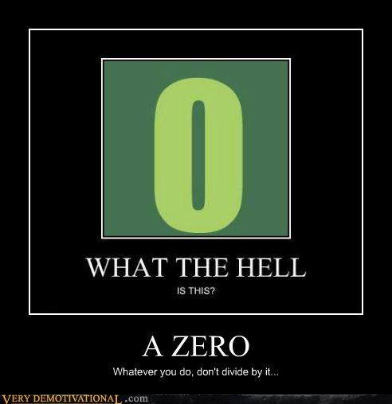

<style type="text/css">
.remark-slide-content {
    font-size: 30px;
    padding: 1em 4em 1em 4em;
}

.small .remark-code { 
  font-size: 80% !important;
}
.tiny .remark-code {
  font-size: 50% !important;
}

</style>

```{r xaringan-themer, include=FALSE, warning=FALSE}
library(xaringanthemer)
style_mono_accent(base_color = "#17139C",link_color = "#DD3E3E")

```


## Goals for semester

- Analyze and interpret general(ized) linear models (aka regression models; aka ANOVA)

- Be able to graph your data

- Identify and diagnose problems when they arise

---
### Important links

- [Class Website](https://shellyc26.github.io/psy5067/index.html)

- [Slack Workspace](https://quantitativem-fbj8840.slack.com); here for answering questions, posting stats/`R` memes and gifs, building community

- [Canvas](https://wustl.instructure.com/courses/126223); where you'll turn in your homeworks

- [LSR](https://learningstatisticswithr.com/book/) & [ISLR](https://www.statlearning.com/); textbooks

- Example data from class can be found on our [GitHub site](https://github.com/shellyc26/psy5067/tree/master/data) in the `data` folder. 

---
## Important information

- **Most important information is on the slides**

- Readings serve to *supplement* and enhance
  * There are some exceptions; 2-3 readings will be required

- Important equations will be presented via slides

---
## Two types of people

- This class is going too slow vs going too fast

--

- If too fast: ASK QUESTIONS AND COME TO CHECK-INS. Also spend lots of time outside of class; learning takes time.

--

- If too slow: ASK QUESTIONS AND COME TO CHECK-INS. There are lots of interesting extensions to these models. I can give you extra readings, or at least point you down a cool path. 

---
## Two AIs

- Ke Ning

- Ran Zhang

Both incredible. USE THEM TO YOUR ADVANTAGE! **Set up meetings with them**. Ask them `R` questions.

---
## Goals for today  

- Quick Review of last semester

- Overview of this semester

- Syllabus

---
### Pragmatics
What you *need* to know:

- R, RStudio 
- Rmarkdown (look at cheatsheets!) and how these convert or "knit" into html/pdf files
- Keep it visual: `ggplot`

--

What you *should* know or strive to learn:
- Keep organized: R Projects
- Keeping track/sharing: osf, github (recommended)
- Keep it simple and readable: `dplyr` & `tidyverse` (recommended)

---
### Visualizing data

- Histograms, probability mass function
- Density plot, probability density function, cumulative density function
- Representing your results through bar, box, & violin plots
- Suggestions:

  1. Avoid wow graphs
  2. Use interpretable scales
  3. LABEL. YOUR. AXES.
  4. Always provide a dispersion estimate
  5. If possible include raw data and/or the distribution

---
## What did we cover last semester?

- A lot!
- Lots of theoretical probability distributions
- Lots of NHST, the good the bad and the ugly
- Lots of statistical tests
  * All had assumptions, most had some modifications (homogeneity of variances etc.)

---
### Running models

$Y = X + E$ 

Dependent variable = Independent Variable(s) + Error

Sum of Squares total = Sums of Squares between + Sums of Squares within

Every model we run this semester will be in the form of $Y = X + E$.  Last semester, every model you ran was in the form of $Y = X + E$. You just didn't know it. 

```{r, eval=FALSE}

t.1 <- t.test(y ~ x, data = d) 
# y is cont and x is a categorical/nominal (dichotomous) factor
```

---
## Comparing models

$$ SSW(restricted) - SSW(full) / stuff $$

- The full is equivalent to $Y = X + E$ and the restricted is equivalent to $Y = E$
- We compared them to ask which $E$ was larger
- The only difference between these two models is our $X$ variable (our IVs). The result is we are asking whether $X$ helps explain variance in $Y$
- Equivalent to asking whether $X$ reduces variance that is *unexplained*

---
### Theoretical probability distributions 

- How you collect & measure your variables determine your analytic tool options

- For IVs, how you measure changes the name of the analysis but not really much else. For DVs, data generating process defines appropriate analyses 

- Binomial, poisson, negative binomial, normal (Gaussian), *t*, *F*, $\chi^2$...

- THIS DOES NOT MEAN WE *NEED* TO HAVE A NORMAL DISTRIBUTION IN OUR DATA

---
## Many distributions

- Population distribution -> sample distribution -> sampling distribution

- Standard error is the standard deviation of the sampling distribution
---

## p-values, NHST, and standard operating procedures 

- $p(D|H_0)$, not $p(H_0|D)$

- Type 1 & 2 errors, power, family wise error

- Issues with NHST

- Questionable research practices & researcher degrees of freedom

---
## Effect size and CIs
- There is imprecision in all that you do. **Document it.** 

- Interpretation and utility of CI?

- Common effect size metrics?

- How does the CI relate to the sample and sampling distribution? 

---
## How to succeed (in class)

- Go through slides, work through code  

- Apply concepts to your own work 

- Devote time 

---
## Relationships & Models

.pull-left[
Theme 1: Tell me $Y$
]

.pull-right[

]

---
## Relationships & Models

.pull-left[
Theme 2: What does $0$ mean?
]

.pull-right[

]


---
class: inverse
## Next time

##### REQUIRED READING 

- You *must* read the Human Fallibility paper. Come prepared. We are not critiquing methods here/trying to tear it apart. We are going to use it as a jumping off point for introspection on how we do our own research.
- I will be emailing you your group and your topic. I will explain everything when we get to class. However, when you come to class on Thursday, please go sit with your group. 


