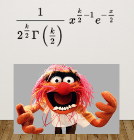

## What have we been doing all year?

- Take a normally distributed variable
- Get deviation scores
- Square the deviation scores
- Sum them up

--

**What are the consequences of doing so?**

---
## Chi-Square Distribution

$\chi^2 = \sum_{i=1}^{k} Z_i^2$

- $Z_i$ = standard normal variable
- $k$ = number of independent variables (**degrees of freedom**)

--

In English:

> $\chi^2$ is created by squaring standard normal variables and adding them together


---
## Chi-Square Distribution

The **chi-square** ( $\chi^2$ ) distribution is very unique in that we really only have one parameter, $k$, which are your **degrees of freedom**

- mean = $k$
- variance = $2k$

It is entirely defined by degrees of freedom! It is the *number of pieces of information that you have*

---

```{r, echo = FALSE, fig.width = 7, warning = FALSE, message = FALSE, fig.align='center'}
ggplot(data.frame(x = seq(0, 50)), aes(x)) +
  stat_function(fun = function(x) dchisq(x, df = 1), 
                aes(color = "k=1")) +
    stat_function(fun = function(x) dchisq(x, df = 2), 
                aes(color = "k=2")) +
    stat_function(fun = function(x) dchisq(x, df = 3), 
                aes(color = "k=3")) +
    stat_function(fun = function(x) dchisq(x, df = 4), 
                aes(color = "k=4")) +
    stat_function(fun = function(x) dchisq(x, df = 6), 
                aes(color = "k=6")) +
    stat_function(fun = function(x) dchisq(x, df = 9), 
                aes(color = "k=9")) +
    stat_function(fun = function(x) dchisq(x, df = 25), 
                aes(color = "k=25")) +
  scale_x_continuous("Variable X") +
  scale_y_continuous("Density") +
  ggtitle("The Chi-Square Distribution") +
  theme_classic(base_size = 24)
```

---
## What kind of crazy function would lead to a distribution like this?!?!!



---
class: inverse, center, middle

## If a tree falls in the forest, and no one is around, does it make a sound?

---

## Trees Example

Let's say a total of 110 trees have fallen. We might *expect* that half of those trees make a sound and half of them don't.
  - 55 trees fall and do make a sound
  - 55 trees fall and do not make a sound

---

## Trees Example

We expect 55 trees to fall per category (sound and no sound). However, our data show that 10 fell and made a sound whereas 100 fell and did not make a sound.

--

This let's build a table that shows us what we have:

```{r}
trees = data.frame(TreesFallen = c(10, 100),
                   Expected = c(55, 55))
rownames(trees) = c("Registered Noise", "No Registered Noise")

trees
```

---

## Trees Example

```{r, echo = FALSE}
trees
```


$$ \chi^2_P = \Sigma\frac{(\text{observed frequency} - \text{expected frequency})^2}{\text{expected frequency}}$$
---

## Trees Example

```{r, echo = FALSE}
trees
```

Step 1: Get the ratio across rows:

$\frac{(10-55)^2}{55}$
$\frac{(100-55)^2}{55}$


```{r}
noise <- ((10-55)^2)/55
noise

noNoise <- ((100-55)^2)/55
noNoise
```

---
## Trees Example

Step 2: Sum these up


```{r}
noise + noNoise
```


---
## Trees Example

Step 3: Determine Degrees of Freedom

df = $(r-1)(c-1)$

df = $(2-1)(2-1)$

df = 1

---

## Trees Example

.left-column[
.small[
$\chi^2(1) = 73.636$
]
]

```{r, echo=FALSE}
ggplot(data.frame(x = seq(0, 100)), aes(x)) +
  stat_function(fun = function(x) dchisq(x, df = 1), 
                color = "black", linetype = "dashed") +
  scale_x_continuous("Variable X") +
  scale_y_continuous("Density") +
  geom_vline(aes(xintercept = 73.636), color = "red") +
  ggtitle("Trees Example") +
  theme_classic()
```

---
## What did we learn?

The $\chi^2$ distribution gives us the probability to find the data (or those more extreme) given a theory (expected values)

--

Comparing that against some threshold for determining whether that probability is within the range of expectations or not

```{r}
pchisq(q = 73.636, df = 1, lower.tail = FALSE)
```

--

Our calculation reflects our value minus some expectation, to understand how far away it is from that expectation.

---
## Interim Summary

- We are comparing observed counts to what we would expect from under a model:

  * If the observed = expected, $\chi^2$ is very small
  * If observed is really different from expected, $\chi^2$ is large
  * Larger $\chi^2$ statistic, given some df parameter, the more likely it is that this model is wrong -- that our data come from something else
  
--

- The $\chi^2$ test statistic is a weighted squared error statistic!

---
## What do we want to know?
Are variables related?
- Chi-square test of association / independence (contingency tables)

--

Does the data match what a model predicts?
- Goodness-of-fit test

--

Does a more complex model improve fit?
- Likelihood ratio test

--

Does the model adequately explain the data?
- Deviance statistic

---
## What do we want to know?

All of these ask the same underlying question:

> How far are the observed data from what the model predicts?

--

$$ \chi^2_P = \Sigma\frac{(\text{observed frequency} - \text{expected frequency})^2}{\text{expected frequency}}$$

---
## Let's go back...

Sometimes we want to know...are two categorical variables related to one another?

- Intervention (yes/no) & Outcome (good/bad)

--

If we want to to know if there's a difference
  - Chi-square test of association

If we want to know the magnitude of the association? 
  - Odds Ratio

---
## Effect Sizes for Chi-Square
    
**Odds Ratio**
OR = number experiencing event divided by number who did not experience event.
  
```{r, echo=FALSE}
tab <- matrix(c("a","b",
                "c","d"),
              nrow = 2,
              byrow = TRUE)

dimnames(tab) <- list(
  Exposure = c("Exposure Yes", "Exposure No"),
  Outcome  = c("Outcome Yes", "Outcome No")
)

knitr::kable(tab, row.names = TRUE)
```

- Odds of outcome given exposure: $\frac{a}{b}$
- Odds of outcome without exposure: $\frac{c}{d}$
- **Odds Ratio**: $\frac{a/b}{c/d}$

---
## All together

- Chi-square test is a *hypothesis* test. Gives you a p-value

- Odds ratios quantify how large the association is. It's an *effect size*

- Interpretation of OR
  
  - OR = 1 → no association (even odds)
  - OR > 1 → exposure increases odds of outcome
  - OR < 1 → exposure decreases odds of outcome
  
--

Cohen (1988) provided the following advice for interpreting odds ratios:

- 1.5 small
- 2.5 medium
- 4.3 large

---

## Where are we going?

Logistic regression estimates *log odds ratios*

---

class: inverse

## Next Time

- Logistic Regression
- Exam 2 on 3/24