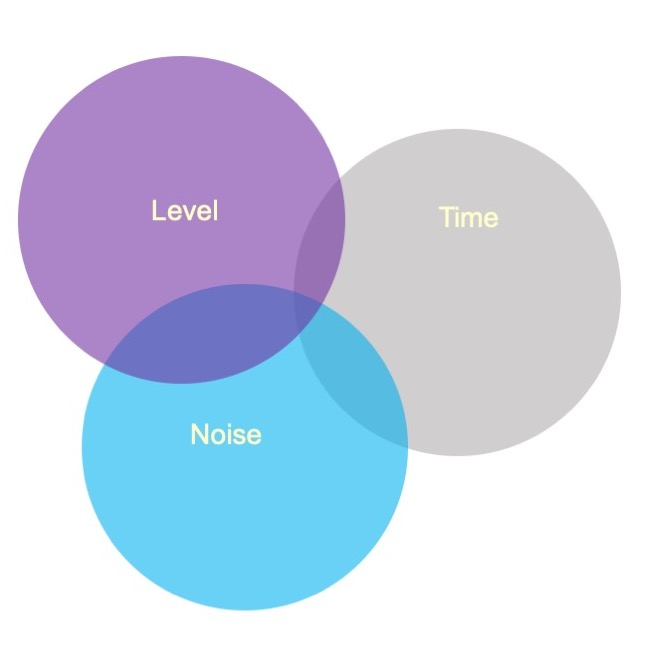
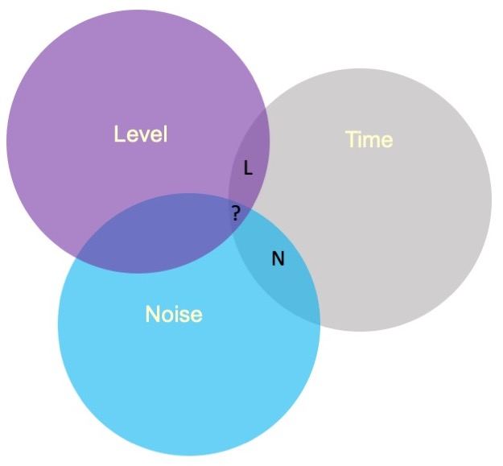

<style type="text/css">
.remark-slide-content {
    font-size: 30px;
    padding: 1em 4em 1em 4em;
}

.small .remark-code { 
  font-size: 80% !important;
}
.tiny .remark-code {
  font-size: 50% !important;
}

</style>

```{r xaringan-themer, include=FALSE, warning=FALSE}
library(xaringanthemer)
style_mono_accent(base_color = "#17139C",link_color = "#DD3E3E")

```

## Last time...

- Factorial ANOVA with Grace
- Qualitative Methods with Amy Eyler

## This time

- Wrapping up Factorial ANOVA
- Power

```{r, echo = F, message = F, warning = F}
library(tidyverse)
library(knitr)
library(kableExtra)
```

---

```{r, echo = F}
set.seed(23)
SD=120

DV_Slow_N <- rnorm(20,mean=600,sd=SD) # draw 20 from normal distribution
DV_Slow_C <- rnorm(20,mean=590,sd=SD) # draw 20 from normal distribution
DV_Slow_U <- rnorm(20,mean=585,sd=SD) # draw 20 from normal distribution

DV_Med_N <- rnorm(20,mean=550,sd=SD) # draw 20 from normal
DV_Med_C <- rnorm(20,mean=450,sd=SD) # draw 20 from normal
DV_Med_U <- rnorm(20,mean=300,sd=SD) # draw 20 from normal

DV_Fast_N <- rnorm(20,mean=310,sd=SD) # draw 20 from normal
DV_Fast_C <- rnorm(20,mean=305,sd=SD) # draw 20 from normal
DV_Fast_U <- rnorm(20,mean=290,sd=SD) # draw 20 from normal

# put DVs together in a data frame; specify Speed and Noise Values
Data = data.frame(Time = c(DV_Slow_N,
                           DV_Slow_C,
                           DV_Slow_U,
                           DV_Med_N,
                           DV_Med_C,
                           DV_Med_U,
                           DV_Fast_N,
                           DV_Fast_C,
                           DV_Fast_U),
                  Speed = rep(c("Slow", "Medium", "Fast"), each = 60),
                  Noise = rep(rep(c("None", "Controllable", "Uncontrollable"), 
                                  each = 20), 3)) #repeat each label 20 times, then repeat that whole sequence 3 times
Data$Speed = factor(Data$Speed, levels = c("Slow", "Medium", "Fast")) # set order of levels as I want them presented
Data$Noise = factor(Data$Noise, levels = c("None", "Controllable", "Uncontrollable")) # set order of levels as I want them presented
```

.pull-left[
The example data are from a simulated study in which 180 participants performed an eye-hand coordination task in which they were required to keep a mouse pointer on a red dot that moved in a circular motion.  
]
.pull-right[

]

Outcome: time of 10th failure. Dot speed: .5, 1, or 1.5 revolutions. Noise: no noise, controllable noise, and uncontrollable noise. 3x3 balanced. 
---

### Marginal/cell means

```{r, echo = F, results = 'asis', message = F, warning = F}
mean.summary = Data %>%
  group_by(Noise, Speed) %>%
  summarize(Time = mean(Time)) %>%
  spread("Speed", "Time")
mean.summary$Noise = as.character(mean.summary$Noise)
mean.summary$Marginal = rowMeans(mean.summary[2:4])
mean.summary[4,1] = "Marginal"
mean.summary[4,2] = colMeans(mean.summary[2:5], na.rm=T)[1]
mean.summary[4,3] = colMeans(mean.summary[2:5], na.rm=T)[2]
mean.summary[4,4] = colMeans(mean.summary[2:5], na.rm=T)[3]
mean.summary[4,5] = colMeans(mean.summary[2:5], na.rm=T)[4]


kable(mean.summary, digits = 2) %>% 
  kable_styling() %>% 
  group_rows(start_row = 1, end_row = 3) %>%
  column_spec(2, background = "#EECACA") %>%
  column_spec(3, background = "#B2D4EB") %>%
  column_spec(4, background = "#FFFFC5") %>%
  column_spec(5, background = "grey", color = "white") %>%
  row_spec(4, background = "white")
```
---


## Running the analysis of variance

```{r}
fit = lm(Time ~ Speed*Noise, data = Data)
anova(fit)
```

---

```{r}
lsr::etaSquared(fit)
```

An effect size, $\eta^2$, provides a simple way of indexing effect magnitude for ANOVA designs, especially as they get more complex.

$\eta^2$ represents the proportion of variance in Y explained by a single factor (or interaction of factors). It is identical in its calculation to $R^2$:

$$\large \eta^2 = \frac{SS_{\text{effect}}}{SS_{\text{Y}}}$$
---

In an experimental design, variance in Y is created, rather than observed, by manipulating participants. The ways in which an experimenter chooses to manipulate participants can chnage variance in Y, making it difficult to compare the effect of a single manipulation across studies with different designs. 

Partial $\eta^2$ helps interpretation by considering only the variance associated with an effect and random variability, which is naturally occurring

$$\text{Partial }\eta^2 = \frac{SS_{\text{effect}}}{SS_{\text{effect}} + SS_{\text{within}}}$$

---


### Differences in means

In a factorial design, marginal means or cell means must be calculated in order to interpret main effects and the interaction, respectively. The confidence intervals around those means likewise are needed.

```{r, echo = F, results = 'asis', message = F, warning = F}
mean.summary = Data %>%
  group_by(Noise, Speed) %>%
  summarize(Time = mean(Time)) %>%
  spread("Speed", "Time")
mean.summary$Noise = as.character(mean.summary$Noise)
mean.summary$Marginal = rowMeans(mean.summary[2:4])
mean.summary[4,1] = "Marginal"
mean.summary[4,2] = colMeans(mean.summary[2:5], na.rm=T)[1]
mean.summary[4,3] = colMeans(mean.summary[2:5], na.rm=T)[2]
mean.summary[4,4] = colMeans(mean.summary[2:5], na.rm=T)[3]
mean.summary[4,5] = colMeans(mean.summary[2:5], na.rm=T)[4]
library(knitr)
library(kableExtra)
kable(mean.summary, digits = 2) %>% kable_styling() %>% group_rows(start_row = 1, end_row = 3)
```

These means will be based on different sample sizes, which has an impact on the width of the confidence interval.

---

If the homogeneity of variances assumption holds, a common estimate of score variability $(MS_{within})$ underlies all of the confidence intervals. 

$$SE_{mean} = \sqrt{\frac{MS_{within}}{N}}$$

$$CI_{mean} = Mean \pm t_{df_{within}, \alpha = .05}\sqrt{\frac{MS_{within}}{N}}$$

The sample size, $N$, depends on how many cases are aggregated to create the mean.

The $MS_{within}$ is common to all calculations if HoV met.
---

```{r, message = F}
anova(fit)
```
---
```{r, message = F}
library(emmeans)
(time_rg = ref_grid(fit))
summary(time_rg)
```

Takes in a model that's already been fitted, and makes a reference grid needed to calculate the estimated marginal means.

---
The `lsmeans( )` function produces marginal and cell means along with their confidence intervals. These are the marginal means for the Noise main effect.

```{r, warning=FALSE, message=FALSE}
noise_lsm = emmeans::lsmeans(time_rg, "Noise")
noise_lsm
```


---

```{r, message=F, warning=F, fig.width=10, fig.height=6, echo = T}
library(sjPlot)
noise_m = plot_model(fit, type = "emm", terms = c("Noise")) + 
  theme_sjplot(base_size = 20)
speed_m = plot_model(fit, type = "emm", terms = c("Speed")) + 
  theme_sjplot(base_size = 20)
library(ggpubr)
ggarrange(noise_m, speed_m, ncol = 2)
```

---

```{r, message=F, warning=F, fig.width=10, fig.height=6}
plot_model(fit, type = "pred", terms = c("Speed", "Noise")) + 
  theme_sjplot(base_size = 20) + theme(legend.position = "bottom")
```
---

### Precision

A reminder that comparing the confidence intervals for two means (overlap) is not the same as the confidence interval for the difference between two means. 


$$
\begin{aligned}
\large SE_{\text{mean}} &= \sqrt{\frac{MS_{within}}{N}}\\
\large SE_{\text{mean difference}} &= \sqrt{MS_{within}[\frac{1}{N_1}+\frac{1}{N_2}]} \\
\large SE_{\text{mean difference}} &= \sqrt{\frac{2MS_{within}}{N}} \\
\end{aligned}
$$
---

### Cohen's D

$\eta^2$ is useful for comparing the relative effect sizes of one factor to another. If you want to compare the differences between groups, Cohen's d is the more appropriate metric. Like in a t-test, you'll divide the differences in means by the pooled standard deviation. The pooled variance estimate is the $MS_{error}$

```{r}
fit = lm(Time ~ Speed*Noise, data = Data)
anova(fit)[,"Mean Sq"]
MS_error = anova(fit)[,"Mean Sq"][4]
```

So to get the pooled standard deviation:

```{r}
pooled_sd = sqrt(MS_error)
```

---

### Cohen's D

```{r}
(noise_df = as.data.frame(noise_lsm))

(d_none_control = diff(noise_df[c(1,2), "lsmean"])/pooled_sd)
```
---

### Other `emmeans` functions

```{r}
em <- emmeans(fit, ~ Speed : Noise )
em 
```
---

```{r}
pairs(em)

```

---


### Follow-up comparisons

Interpretation of the main effects and interaction in a factorial design will usually require follow-up comparisons.  These need to be conducted at the level of the effect.

Interpretation of a main effect requires comparisons among the marginal means.

Interpretation of the interaction requires comparisons among the cell means.

The `emmeans` package makes these comparisons very easy to conduct.

---

```{r, warning=FALSE, message=FALSE}
noise_lsm = emmeans::lsmeans(time_rg, "Noise")
pairs(noise_lsm, adjust = "holm")
```

---

### Cohen's D the easy way

```{r}
em.ef <- emmeans(fit, pairwise ~ Noise)
eff_size(em.ef, sigma = sigma(fit), edf = 171)
```


---

## Assumptions

You can check the assumptions of the factorial ANOVA in much the same way you check them for multiple regression; but given the categorical nature of the predictors, some assumptions are easier to check.

---

### Assumptions

Homogeneity of variance, for example, can be tested using Levene's test, instead of examining a plot.

```{r, message = F, warning = F}
library(car)
leveneTest(Time ~ Speed*Noise, data = Data)
```

---


If designs are balanced, then the main effects and interaction effects are independent/orthogonal. In other words, knowing what condition a case is in on Variable 1 will not make it any easier to guess what condition they were part of in Variable 2. 

However, if your design is unbalanced, the main effects and interaction effect are partly confounded. 

```{r, echo = F}
set.seed(23)
SD=120

DV_Soft_C <- rnorm(10,mean=590,sd=SD) # draw 10 from normal distribution
DV_Soft_U <- rnorm(30,mean=585,sd=SD) # draw 30 from normal distribution

DV_Loud_C <- rnorm(20,mean=450,sd=SD) # draw 20 from normal
DV_Loud_U <- rnorm(20,mean=300,sd=SD) # draw 20 from normal


# put DVs together in a Data2 frame; specify Speed and Noise Values
Data2 = data.frame(Time = c(DV_Soft_U,
                           DV_Soft_C,
                           DV_Loud_U,
                           DV_Loud_C),
                  Level = rep(c("Soft", "Loud"), each = 40),
                  Noise = c(rep("Controllable", 10), 
                            rep("Uncontrollable", 30), 
                            rep(c("Controllable", "Uncontrollable"), each = 20)))
Data2$Level = factor(Data2$Level, levels = c("Soft", "Loud")) # set order of levels as I want them presented
Data2$Noise = factor(Data2$Noise, levels = c("Controllable", "Uncontrollable")) # set order of levels as I want them presented
```

```{r}
table(Data2$Level, Data2$Noise)
```

---

.pull-left[
The overlap represents the variance shared by the variables. Now there is variance accounted for in the outcome (Time) that cannot be unambiguously attributed to just one of the predictors There are several options for handling the ambiguous regions.]
.pull-right[

]
---

.pull-left[
]

.pull-right[
Overlap handled in 3 ways: Type I, Type II, and Type III sums of squares. 

All credit goes to Matt Cooper (no relation!) and this great blog post. I'm going to paraphrase from his post since I think he does a great job making it clear -- you can check it out [here](https://mcfromnz.wordpress.com/2011/03/02/anova-type-iiiiii-ss-explained/). 
]

---
### Sums of Squares

$SS(A, B, AB)$ is sum of squares for both main effects and interaction

$SS(A, B)$ is sum of squares for a model with no interaction

$SS(B, AB)$ is sum of squares for model that does not account for the effects from factor A

---

### Sum of Squares

> The influence of particular factors (including interactions) can be tested by examining the differences between models. For example, to determine the presence of an interaction effect, an F-test of the models $SS(A, B, AB)$ and the no-interaction model $SS(A, B)$ would be carried out.

--

Read the pipe `|` as "after"; $SS(AB | A,B)$ is *"the sum of squares for interaction after the main effects"* 

---

### Type 1 SS (aka sequential)

Test for main effect of A, followed by main effect of B, followed by interaction. ORDER MATTERS! The overlapping part of the venn diagram goes to whichever factor is listed first (a priority rule). Rule needs to be justified or else you might be p-hacking. 


| Effect | Type I            | Type II           | Type III            |
|--------|-------------------|-------------------|---------------------|
| A      | SS(A)         |       | |
| B      | SS(B&#124;A)       |       | |
| A:B    | SS(AB&#124;A,B)    |     |   |

---

If a design is quite unbalanced, different orders of effects can produce quite different results.

```{r}
fit_1 = aov(Time ~ Noise + Level, data = Data2)
summary(fit_1)
lsr::etaSquared(fit_1, type = 1)
```

---

If a design is quite unbalanced, different orders of effects can produce quite different results.

```{r}
fit_1 = aov(Time ~ Level + Noise, data = Data2)
summary(fit_1)
lsr::etaSquared(fit_1, type = 1)
```

---
### Type 2 SS (aka hierarchical)

Test for each of the main effects after the other main effect. **No signifiant interaction is assumed**. So you'll need to first test for your interaction. If it's not significant, then you can examine your main effects with Type 2 SS.


| Effect | Type I            | Type II           | Type III            |
|--------|-------------------|-------------------|---------------------|
| A      | SS(A)         | SS(A&#124;B)       |  |
| B      | SS(B&#124;A)       | SS(B&#124;A)       ||
| A:B    | SS(AB&#124;A,B)    | ---    |    |

---

### Type 3 SS
Tests the presence of a main effect after the other main effect and interaction. Basically, the overlapping area of the venn diagram goes unclaimed. Useful for interactions. Less useful for main effect (what does a main effect tell you if you have a significant interaction?)

| Effect | Type I            | Type II           | Type III            |
|--------|-------------------|-------------------|---------------------|
| A      | SS(A)         | SS(A&#124;B)       | SS(A&#124;B,AB) |
| B      | SS(B&#124;A)       | SS(B&#124;A)       | SS(B&#124;A,AB) |
| A:B    | SS(AB&#124;A,B)    | SS(AB&#124;A,B)    | SS(AB&#124;A,B)   |

.tiny[For Type II:  significant interaction is assumed (in other words, you should test for interaction first (SS(AB&#124;A,B)) and only if AB is not significant, continue with the analysis for main effects).]
---

The `aov( )` function in R produces Type I sums of squares. The `Anova( )` function from the `car` package provides Type II and Type III sums of squares.

These work as expected provided the predictors are factors.

```{r}
Anova(aov(fit), type = "II")
```


---

All of the between-subjects variance is accounted for by an effect in Type I sums of squares.  The sums of squares for each effect and the residual will equal the total sum of squares.

For Type II and Type III sums of squares, the sums of squares for effects and residual will be less than the total sum of squares. Some variance (in the form of SS) goes unclaimed.

The highest order effect (assuming standard ordering) has the same SS in all three models.

**When a design is balanced, Type I, II, and III sums of squares are equivalent.**

---

### Summary (ANOVA and Regression)

Factorial ANOVA is the method by which we can examine whether two (or more) categorical IVs have joint effects on a continuous outcome of interest.

Like all general linear models, factorial ANOVA is a specific case of multiple regression. However, we may choose to use an ANOVA framework for the sake of interpretability. 

---
### Summary (ANOVA and Regression)

.pull-left[
#### Factorial ANOVA

Interaction tests whether there are differences in differences.

A main effect is the effect of one IV on the DV **ignoring the other variable(s)**.
]
.pull-right[
#### Regression

Interaction tests whether slope changes. 

A conditional effect is the effect of IV on the DV **assuming all the other variables are 0**.
]


---

## Power

What is statistical power? How can we increase power?

--

The likelihood of finding an effect *if the effect actually exists.* Power gets larger as we:
* increase our sample size
* reduce (error) variance
* raise our Type I error rate
* study larger effects


---

```{r, echo = F, fig.width = 10, fig.height = 8, message = F}
library(tidyverse)
mu = 100
s = 20
mean = 110
n = 20
sem = s/sqrt(n)
cv = qnorm(mean = mu, sd = sem, p = .05, lower.tail = F)

ggplot(data.frame(x = seq(70, 130)), aes(x)) +
  stat_function(fun = function(x) dnorm(x, m = mu, sd = sem)) +
  stat_function(fun = function(x) dnorm(x, m = mean, sd = sem)) +
  stat_function(fun = function(x) dnorm(x, m = mean, sd = sem),
                geom = "area", xlim = c(cv, 130), 
                aes(fill = "Power"), alpha = .5) +
  #geom_vline(aes(xintercept = mu))+
  #geom_vline(aes(xintercept = mean))+
  geom_hline(aes(yintercept = 0))+
  scale_x_continuous("Means", breaks = seq(70,130,10)) +
  scale_y_continuous(NULL, breaks = NULL) + 
  guides(color = "none")+
  theme_bw()+
  theme( text = element_text(size = 20))
```

---

### Power in multiple regression (additive effects)

When calculating power for the omnibus test, use the expected multiple $R^2$ value to calculate an effect size:

$$\large f^2 = \frac{R^2}{1-R^2}$$
---

## Omnibus power
```{r}
R2 = .10
(f = R2/(1-R2))
```


---
## Omnibus power

```{r}
library(pwr)
pwr.f2.test(u = 3, # number of predictors in the model
            f2 = f, 
            sig.level = .05, #alpha
            power =.90) # desired power
```

`v` is the denominator df of freedom, so the number of participants needed is v + k (number of predictors) + 1.

---

### Coefficient power

To estimate power for a single coefficient, you need to consider (1) how much variance is accounted for by just the variable and (2) how much variance you'll account for in Y overall.

$$\large f^2 = \frac{R^2_Y-R^2_{Y.X}}{1-R_Y^2}$$
---
### Coefficient power

```{r}
R2 = .10
RX1 = .03
(f = (R2-RX1)/(1-R2))

```

---

### Coefficient power
```{r}
pwr.f2.test(u = 3, # number of predictors in the model
            f2 = f, 
            sig.level = .05, #alpha
            power =.90) # desired power
```

`v` is the denominator df of freedom, so the number of participants needed is v + k + 1.
---

class: inverse

## Next time...

Powering interactions

Polynomials