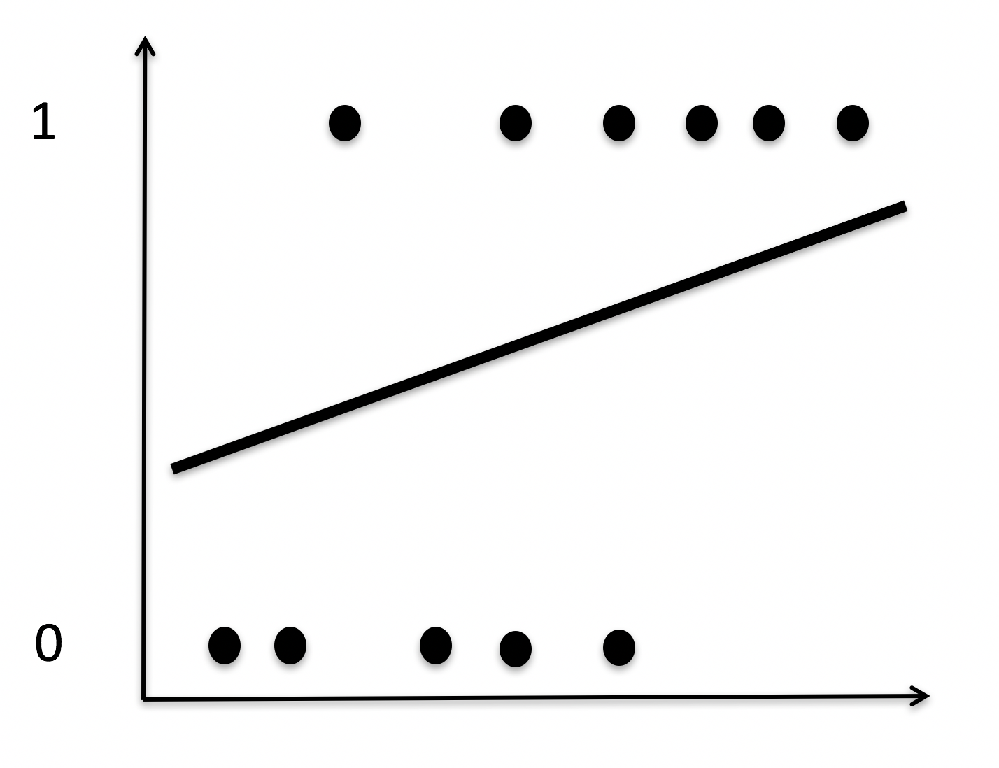
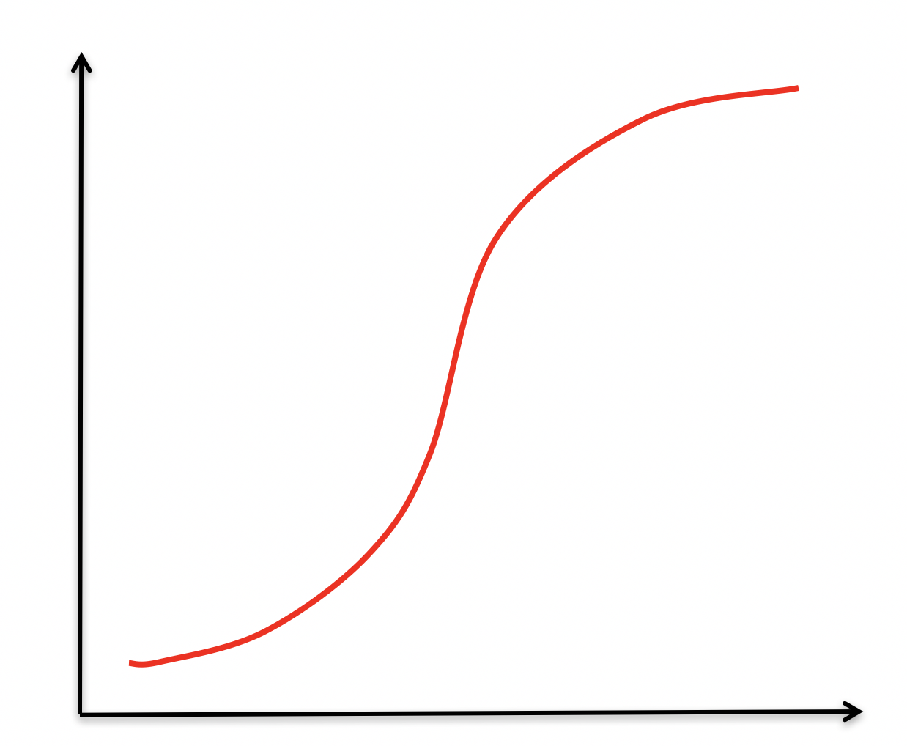

```{r xaringan-themer, include = FALSE}
library(tidyverse)
library(broom)
```

<style type="text/css">
.remark-slide-content {
    font-size: 30px;
    padding: 1em 4em 1em 4em;
}

.small .remark-code { 
  font-size: 80% !important;
}
.tiny .remark-code {
  font-size: 65% !important;
}
</style>
## Logistic Regression

Used when your DV is binary (0,1)  
    - Clinical diagnosis   
    - Disease prevalence    
    - Experiences (Yes/No)    
---

## Assumption violations
    
Violates:      
    - Correctly specified form  
    - Homoscedasticity   
    - Normality of the errors  
    
---
```{r out.width = '80%', echo = FALSE}

knitr::include_graphics("images/Log.1.png")
```


---
```{r out.width = '80%', echo = FALSE}


```

---
```{r out.width = '80%', echo = FALSE}

knitr::include_graphics("images/Log.3.png")
```

---
## Need to think in terms of probabilities

- If we use OLS, we violate assumptions and have predicted values that go outside 0 & 1   
- How does the predicted probability of getting a 0 or a 1 relate to our predictors?       

$$\hat{p}_{i} \leftrightsquigarrow b_{0} + b_{1}X_{1} + b_{2}X_{2}... b_{3}X_{p}$$

---
## Generalized linear models 

- extend the general linear model framework
- used to describe different Data Generating Processes (DGPs) other than gausian normal
- need to use if we cannot use the Gaussian normal e.g. the range of Y is restricted (e.g. binary, count) and/or the variance of Y depends on the mean, etcetera
- in other words, what is your DGP?
<br>


---
## Generalized linear models 
.pull-left[
- Gaussian model is 
$$y_i \sim  N(\mu_i, \sigma)$$

$$\mu_i = \alpha + \beta x_i$$
]

.pull-right[
- Binomial outcome is
$$y_i \sim  Binomial(n, p_i)$$

$$f(p_i) = \alpha + \beta x_i$$
]

---
-GLM components

1. Describe Family. What distribution is your DGP? 

2. Specify Link Function. How does your outcome relate to the predictors. 

It is not common to have an average outcome $\mu$ (other than in a normal distribution) and it is not common to have parameters range from negative to positive infinity. We need something that translates our model into the parameters that describe the distribution.  

---
## Logistic regression
$$y_i \sim  Binomial(n, p_i)$$

$$f(p_i) = \alpha + \beta x_i$$
 
 Our number of trials is N, (here it is 1, technically a Bernoulli) so we are predicting the probability of y. Probabilities are bounded between zero and one. 
 
 Because our variables are not in probability units we need to "link" them via a function. The linear right side of the equation is not in the same units as the non-linear left side  
 
 Two most popular are logit and log. Others are available too: probit, negative inverse, cloglog. Typically, if you define your distribution there is a link that is recommended. 

---
## Link function for logistic

- we need to map (0,1) to $(-\infty, \infty)$
- Logistic regression uses the logistic function to link the predicted probabilities to the predictors   
- Think of it as a transformation of Y-hats
$$g(\mu) = logit(\mu) = log (\frac {\mu_{i}}{1-\mu_{i}})$$

---
.pull-left[
$$f(x) = \frac{1}{1+e^{-X}}$$
]

.pull-right[
```{r out.width = '80%', echo = FALSE}


```
 ]
 
---
$$f(x) = \frac{1}{1+e^{-X}}$$
$$\hat{p} = \frac{1}{1+e^{-b_{0}+b_{1}X}}$$
- The form of the logistic function is still nonlinear (because probabilities can only range from 0 to 1)  
- Solution is to convert probabilities into odds 

---
## odds

- Odds are defined as the probability of being a case divided by the probability of being a noncase
- Not bound between 0 and 1 
- Range from 0 to infinity
- less than one is less than 50% probability
$$odds = \frac {\hat{p}}{1-\hat{p}}$$

$$probability= \frac{\hat{odds}}{1+\hat{odds}}$$

---
## linear probability model

$$f(x) = \frac{1}{1+e^{-X}}$$
$$\hat{p} = \frac{1}{1+e^{-b_{0}+b_{1}X}}$$

$$odds = \frac {\hat{p}}{1-\hat{p}}=e^{b_{0}+b_{1}X}$$
$$logit= Log(odds)=ln(\frac{\hat{p}}{1-\hat{p}}) = b_{0}+b_{1}X$$

---
$$logit= Log(odds)=ln(\frac{\hat{p}}{1-\hat{p}}) = b_{0}+b_{1}X$$

-Predicted scores are not dichotomous   
-Instead of predicting probabilities directly, we are instead predicting the log of the odds.


---
## other distributions

- Exponential, which normal, gamma, binomial, Possion are apart of
- Exgaussian, beta, multi-nomial, zero inflated poisson...

---
## estimation  

- Maximum likelihood 
- OLS minimizes the errors, which also maximize R   
- In logistic regression we are not so lucky  
- Need to rely on iterative procedure, ML Estimation
- Asymptotic standard errors (approximations)  
- Interpret test statistics as z’s, not t’s  
- Wald test = chi square with 1 df = z^2 when F(1, infinity)

---
## GLM in R

```{r, eval=FALSE}

glm(formula, family = gaussian(link="identity"), data, weights, subset, na.action, start = NULL, etastart, mustart, offset, 
    control = glm.control(...), model = TRUE,
  method = ”glm.fit”, x = FALSE, y = TRUE, contrasts = NULL, ...)
```

- Family Argument
The family argument specifies the distribution. While link specifies link. In R, families have default links. 

---
```{r, eval=FALSE}

glm(y ~ X1+ X2 + X3 , family = binomial, data = dataset)

  binomial(link = "logit")
  gaussian(link = "identity")
  Gamma(link = "inverse")
  inverse.gaussian(link = "1/mu2")  
  poisson(link = "log")
```

---
## how to interpret
- b1 is the predicted change in the logit for a 1-unit change in X, holding the other predictors constant 

- For a one-unit change in X, holding other predictors constant, the odds that Y = 1 changes by $e^{b_{1}}$   

- e.g,. $b_{1}$ = .4, $e^{.4}$ = 1.49 

- for fitted values, need to use entire equation
$$\hat{Y} = e^{b_{0}+b_{1}X_{1}}$$

- turn to probabilities by: odds/(1+odds)

---

```{r, echo = FALSE, warning=FALSE, message=FALSE}
library(readr)
Personality_longevity <- read_csv("https://raw.githubusercontent.com/josh-jackson/5067-Spring-2020/master/static/Lectures/Personality_longevity.csv")

library(dplyr)
mortality <- Personality_longevity %>% 
  select (Time, Intelligence_Self, Intelligence_Mate) %>% 
  mutate(premature.d = cut(Time, breaks=c(-Inf, 62, Inf),
                     labels=c("premature","normal"))) %>% 
  select(-Time)
  
mortality$NOT.premature <- dplyr::recode(mortality$premature.d, normal ="1", premature="0")
  
mortality$NOT.premature <- as.numeric(as.character(mortality$NOT.premature ))


  
```
.tiny[
```{r}
# 1 = not premature
mortality
```
]

---
.tiny[
```{r}

death.1 <- lm(NOT.premature ~ Intelligence_Self , data = mortality)
summary(death.1)
```
]

---
.tiny[
```{r}

death.2 <- glm(NOT.premature ~ Intelligence_Self , data = mortality)
summary(death.2)
```
]

---
```{r}
anova(death.1)
```

---
```{r}
anova(death.2)
```

---
.tiny[
```{r}
death.3 <- glm(NOT.premature ~ Intelligence_Self,
               family = binomial, data = mortality)
summary(death.3)
```
]
---
```{r}
exp(1)^.08012

#For every 1 unit increase in Intelligence 
#the odds of living increase by 8%.

#prob = 
1.083417/(1+1.083417)

exp(1)^(.08012*20 + 0.28695)
 
6.615067/ (1+6.615067)

```

---
## probit 

.tiny[
```{r}
death.4 <- glm(NOT.premature ~ Intelligence_Self,
        family = binomial(link = "probit"), data = mortality)
summary(death.4)
```
]

---
.tiny[
```{r}
both <- glm(NOT.premature ~ Intelligence_Mate +Intelligence_Self, 
                 family = binomial, data = mortality)
summary(both)
```
]

---

```{r}
cor(mortality$Intelligence_Self, mortality$Intelligence_Mate)
```
