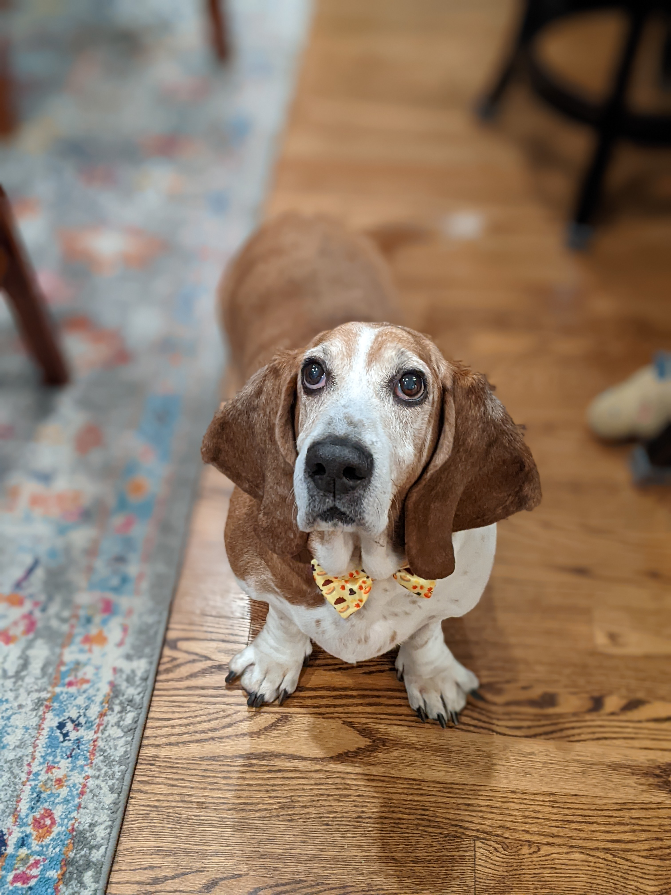
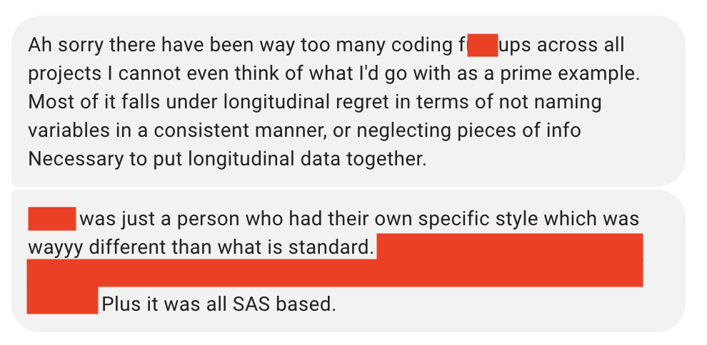

class: center, middle

--

Today is Academic Scared Straight day!

---

## The Stuff Nightmares Are Made of...

- Stories from myself and others you know
- Then we will break up into groups to talk about your own data management processes

---

## Yours Truly

.pull-left[

]

.pull-right[

- Story 1 - beta testing
- Story 2 - rewriting code
]

---

## Jo Etzel -- Staff Scientist

.pull-left[

]

.pull-right[

.small[

[An analysis] was coming out *too good*; ...some of the
effects were just implausibly large, and not affected by the conditions like they should have been. ...We discovered it was a communication error resulting in incorrect condition labels. I hadn't preprocessed the dataset myself; a colleague ran the experiment at a different university and we had several meetings about its files. ...I coded up the conditions as
described in my notes from the meetings ... but my notes were wrong. 

This only resulted in lost time and aggravation. But it was really tricky, since some of the results came out better, not worse, and the error was in my initial task/file description (so wasn't found by me comparing the code with my notes - those matched).

The experience was also an illustration that not all mistakes make noise/null results; just because you have [results] doesn't mean things worked properly.
]
]

---

## Steve Mennerick -- Professor of Psychiatry, Co-Chair of DBBS Curriculum

.pull-left[

]

.pull-right[
.small[ 
I [a grad student] was characterizing the % of hippocampal neurons in culture that used glutamate vs. GABA. My PI decided to help with increasing the N. My own data suggested that ~80% of neurons used glutamate.  However, when my PI started recording, he got nearly reversed results from mine – nearly 80% GABAergic.  We eventually traced the discrepancy to unconscious biases we each had in cell selection.  Each of us was conditioned by previous studies we had performed to overlook cells of a certain shape.  Ultimately, I repeated the experiment, forcing myself to record each and every cell that I encountered.  The final result was approximately half and half. It was a lesson in unconscious bias/data selection; I truly didn’t ‘see’ the cells making up a large fraction of the neurons in the culture. Consequences were time loss and embarrassment.
]
]

---
## Kelli Huber -- Consultant

.pull-left[

]

.pull-right[
Kelli joined a lab that had the following predicament: 

- Postdoc worked in lab, collected and managed all the data. Data were password protected.
- Said postdoc gets a new job and leaves the lab (standard practice)
- Password goes with the postdoc. They can't reach the postdoc. 
- The data was locked away for ~3 years before it was able to be accessed and analyzed. 
]

---

## Josh Jackson -- Professor of Psychology

.pull-left[

]

.pull-right[

]

---
## Hillary Anger Elfenbein -- Professor and Chair of Organizational Behavior

.pull-left[

]

.small[
1. I just got a paper accepted to PSPB in which we have a footnote saying that a record-keeping error caused us not to be able to report reliability for one of our variables.  The variables in this study were painstakingly coded by an army of undergrads who read the transcripts of people negotiating.  The two graduate students who ran the coding process both left academia and didn’t keep their files.  We had the reliability data about all the variables except one, by digging out an early version of the manuscript write-up, but one variable was added later and now we’ll never know.  The lesson here is for multiple collaborators to keep the data in their files, although I’ll admit that sometimes I still neglect to do this with student coauthors and really should.

2. I had a grad school classmate who coded participant “sex” as 0/1 and later forgot which direction was which.  The lesson here is always to code sex as “female” (or “male”) 0/1, which also makes it easier for the readers.

3. My grad school mentor withdrew an accepted paper from a top journal because she realized that one of the variables was coded backwards.  
]

---

## Julia Strand -- Professor of Psychology at Carelton College

.pull-left[

]

.pull-right[

https://www.juiceandsqueeze.net/17

[Toward A More Robust Science: Transparency, Replicability, and Self-Correction](https://youtu.be/BMlZYWB4crg)
]

---

## Today's Activity is Error Tight

- **Step 1:** for each of the 3 research stages (you should have received an email from me about which group you are in and which research stage you've been assigned), **talk about where errors could arise at each stage**

- **Step 2: identify concrete steps that could be used to reduce the likelihood of making such errors**

- **Step 3: discuss what you can do if you _do_ find an error**

- 1 person in your group should type this all up. Email it to the rest of your group with me cc'd so that you all have these suggestions. 

- This is essentially a brainstorming activity. Be honest and transparent about your own work.
