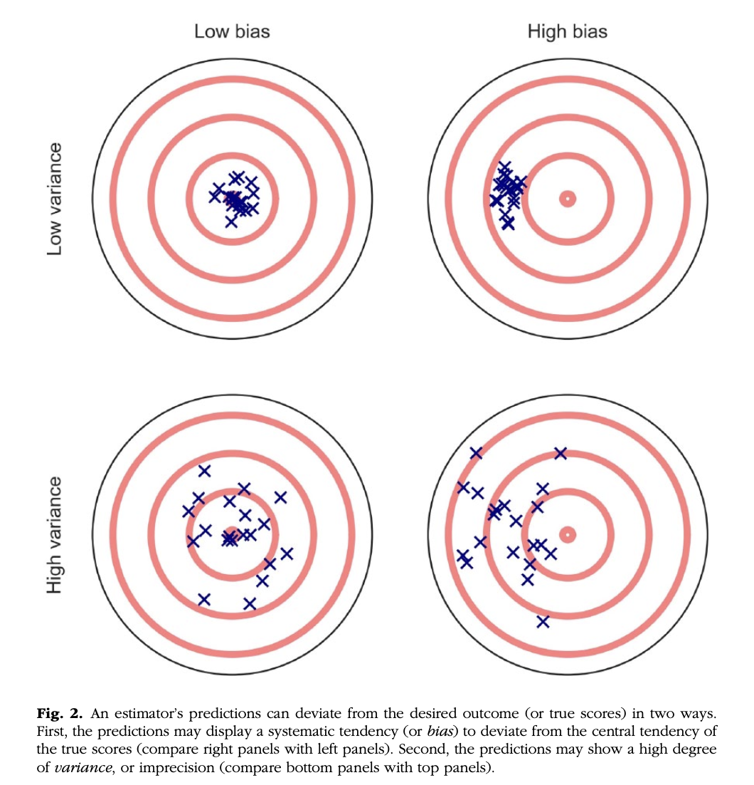

```{css, echo=FALSE}
.tiny {
  font-size: 0.5em;
}
```


```{r, echo = F, message = F, warning = F}
library(tidyverse)
```


## Last time...

- Resampling methods via Bootstrapping

## Today

* Lessons from **machine learning**

---
## Explanation vs. Prediction

*Explanation*: describe causal underpinnings of behaviors/outcomes

*Prediction*: Accurately forecast behaviors/outcomes

--

Similarities
- Both are goals of science
- Good predictions can help us develop theories of explanation and vice versa

--

Statistical Tensions
- Statistical models that accurately describe causal truths often have poor prediction and are complex
- Predictive models are often very different from the "true", underlying data generating processes

---

## Explanation vs. Prediction

#### What do we do in Psychology and Neuroscience?
- Mostly we're in explanation territory

#### What about regression?
- Though it can be used for prediction, generally, we apply it more in an explanation setting. "Does ----- explain variability in -----?"

#### Point of Yarkoni & Westfall (2017)
- How far have we really come in the past 10 years? 20 years? 30 years? ...not as far as we'd like
- *We should spend more time and resources developing predictive models than we currently do*

---
class: center, middle


---
## Some definitions you might find helpful

- **machine learning** is the process of feeding previous observations into a computer and using the computer to generate predictions for new observations. AKA:
  - machine inference
  - pattern recognition (Google Photos!)
  - statistical estimation
  - prediction modeling
  - statistical learning (ish)
- **training** occurs by extracting patterns from the observed data; think of this as *learning*
- **testing** occurs by verifying predictions on previously unobserved data; think of this as *evaluating*
- this concept is not the same as **artificial intelligence** (AI is the simulation of human intelligence by computers; AI systems are generally trained with machine learning approaches)

---

## Some more definitions

- **supervised learning:** using known patterns between input and output observations to train a mapping between the two
  - **regression!** learning the mapping between a continuous input feature variable and a continuous output target variable
  - **classification:** learning the mapping between a continuous input feature variable and a categorical output target variable (i.e., a label)

--

- **unsupervised learning:** determining patterns in observations without guiding referents
  - **dimensionality reduction:** decreasing the overall number of features considered in a learning procedure (i.e., PCA, ICA etc.)
  - **clustering:** grouping features together that are similar as determined by *some* metric

---

## @Wash U

- **reinforcement learning:** determining a mapping between input and output observations using only a measure of training quality

--

- ML classes in CS department
- Wouter Kool for reinforcement learning (maybe Zach Reagh but don't quote me)
- ACCSN with Dennis Barbour and myself for high level discussions on these topics
- Poli Sci department for dealing with categorical outcomes

---

## Machine Learning Algorithms
.pull-left[
- ordinary least squares linear regression
- logistic regression
- k-means clustering
- nearest neighbor
- naive Bayes
- ridge regression
- LASSO regression
]

.pull-right[
- support vector machine
- random forest
- Gaussian process estimator
- multilayer perceptron (deep net)
- convolutional network
- recurrent network
- generalized adversarial network
]

---
## Some terminology

**Overfitting** is when we *mistakenly* fit sample-specific noise as if it were actually a signal. 

- If our model has a $R^2 = .9$, we do an excellent job of explaining variance *in our sample*. 
- OLS models tend to be overfit because they minimize error for a specific sample

--

**Bias** refers to systematically over- or under-estimating parameters.

**Variance** refers to how much estimates tend to jump around

**Bias-Variance Tradeoff** we can reduce variance around our estimates but at the expense of increasing bias of estimates and vice versa

.tiny[**Underfitting** means we can't capture a relationship at all -- not as big of a problem for us]

---

class: center, middle



---
class: center, middle, inverse

# You should be afraid...very afraid

---

## Proposals
How do we take what we know from overfitting & the bias-variance tradeoff and incorporate it? What can we learn from the ML world?

--

**Big Data**
* Reduce the likelihood of overfitting -- more data means less error

**Cross-validation**
* Is my model overfit?

**Regularization**
* Constrain the model to be less overfit 

---

## Big Data Sets

"Every pattern that could be observed in a given dataset reflects some... unknown combination of signal and error" (page 1104). 

Error is random, so it cannot correlate with anything; as we aggregate many pieces of information together, we reduce error. 

Thus, as we get bigger and bigger datasets, the amount of error we have gets smaller and smaller

<center>


---

## Cross-validation

**Cross-validation** is a family of techniques that involve testing and training a model on different samples of data. 

---

## Cross-validation

#### Hold-out Samples
- Split into training and testing sets
- Fit your model on the training set
- Using this training set, predict the outputs for the sample in your testing set

--

Pros

* Straightforward
* Not a lot of computational power needed

--

Cons

* How do you choose which data go into the testing set or the training set?
* What if the vast majority of group A fall into the training set and the vast majority of group B fall into the testing set? 

---
## K-fold Cross-validation

- Make _k_ subsets of your data
- Repeat the hold-out method of test/train, but do it _k_ times
- Get the model fit for all _k_ iterations; take the average model fit


.tiny[https://en.wikipedia.org/wiki/Cross-validation_(statistics)]
---
## K-fold Cross-validation

Pros

- Doesn't matter much which data points fall into test or train since each subset can be both a test and a training set

- The more folds you do (larger _k_), the more you are able to decrease your variance around your averaged model fit

--

Cons

- Can take a decent amount of computational power, depending on the dataset


---
## Cross-validation
#### Leave-one-out

- Same as _k_-fold, but now _k_ is equal to your $N$

--

Pros

- Good estimations

--

Cons

- Even more computationally expensive
- Especially if using "big data"
    
---

```{r, message=FALSE, warning = F}
library(here)
stress.data = read.csv(here("data/stress.csv"))
library(psych)
describe(stress.data, fast = T)

model.lm = lm(Stress ~ Anxiety*Support*group, 
              data = stress.data)
summary(model.lm)$r.squared
```

---

### Example: 10-fold cross validation

.small[Note, newer package called `tidymodels` is better for machine learning, but requires many more steps. For now, this is the simpler method. If you're going hard with ML, check out `tidymodels` or use Python `r emo::ji("snake")`]

.code-small[
```{r, message = F}
library(caret)
# set control parameters
ctrl <- trainControl(method="cv", number=10)
# use train() instead of lm()
cv.model <- train(Stress ~ Anxiety*Support*group, 
               data = stress.data, 
               trControl=ctrl, # what are the control parameters
               method="lm") # what kind of model
cv.model
```
]


---

## Regularization

Penalizing a model as it grows more complex. 
* Usually involves _**shrinking**_ coefficient estimates -- the model will fit less well in-sample but may be more predictive

--

*LASSO regression*: balance minimizing sum of squared residuals (OLS) and minimizing smallest sum of absolute values of coefficients
- Penalize the size of the coefficients
- The larger the penalty applied, the more estimates are go towards zero (or "shrink" -- the first "S")
- Coefficients are more biased (tend to underestimate coefficients) but produce less variability in results
- Also helps with variable selection

The coefficient $\lambda$ is used to penalize the model.

---
## Lasso Regression
The `glmnet` package has the tools for LASSO regression. One small complication is that the package uses matrix algebra, so you need to feed it a matrix of predictors -- specifically, instead of saying "find the interaction between A and B", you need to create the variable that represents this term.


Luckily, the function `model.matrix()` can do this for you.

---

```{r, message = F, warning = F}
# provide your original lm model to get matrix of predictors
X.matrix <- model.matrix.lm(model.lm) 
head(X.matrix)
library(glmnet)
lasso.mod <- glmnet(x = X.matrix[,-1], #don't need the intercept 
                    y = stress.data$Stress)
```

---
.pull-left[
```{r}
lasso.mod
```
]

.pull-right[
<br />
<br />
<br />
<br />
<br />
* DF = number of non-zero coefficients
* dev = $R^2$
* lambda = complexity parameter
    * how much to down-weight
    * between 0 & 1
    
]

---
## What value of $\lambda$ to choose?

.pull-left[
```{r}
plot(lasso.mod, xvar = "dev", label = T)
```
]

.pull-right[Looks like coefficients 1, 2, and 3 have high values even with shrinkage.
]

---
## What value of $\lambda$ to choose?
```{r, fig.height=5}
plot(lasso.mod, xvar = "lambda", label = TRUE)
```

I might look for lambda values where those coefficients are still different from 0. 

---
.pull-left[
```{r}
coef = coef(lasso.mod, s = exp(-5))
round(x = coef, digits = 2)
```
]

.pull-left[
```{r}
coef = coef(lasso.mod, s = exp(-4))
round(x = coef, digits = 2)
```
]


---

```{r}
coef = coef(lasso.mod, s = 0)
coef
```

$\lambda = 0$ is pretty close to our OLS solution

---

```{r}
coef = coef(lasso.mod, s = 1)
coef
```

$\lambda = 1$ is a huge penalty

---

.pull-left[

Choosing a lambda based on eyeballing can be hard. We can use cross-validation instead to help us choose!

```{r}
cvfit <- cv.glmnet(x = X.matrix[,-1], y = stress.data$Stress, type.measure = "deviance")
cvfit
```

]

.pull-right[
```{r}
plot(cvfit)
```
]


---
## NHST no more

Once you've imposed a shrinkage penalty on your coefficients, you've wandered far from the realm of null hypothesis significance testing.

In general, you'll find that very few machine learning techniques are compatible with probability theory (including Bayesian), because they're focused on different goals.

Instead of asking, "how does random chance factor into my result?", machine learning optimizes (out of sample) prediction. Both methods explicitly deal with random variability.

In NHST and Bayesian probability, we're trying to estimate the degree of randomness; in machine learning, we're trying to remove it. 

---

## Summary: Yarkoni and Westfall (2017)


**Big Data**
* Reduce the likelihood of overfitting -- more data means less error

**Cross-validation**
* Is my model overfit?

**Regularization**
* Constrain the model to be less overfit 

---
class: inverse

# Review on Tuesday

# Final exam on Thursday

