## Today

- path diagrams
- partial and semi-partial correlations

---

## Causal relationships

Does parent socioeconomic status *cause* better grades?

  * $r_{GPA,SES} = .33, b = .41$
  
--

Potential confound: Peer relationships

   - $r_{SES, peer} = .29$
   - $r_{GPA, peer} = .37$

???

Don't know how variables are related, only know that they are

in a perfect world, we would want to **hold constant** peer relationships
- control for
- partial out

---
## Does parent SES cause better grades?

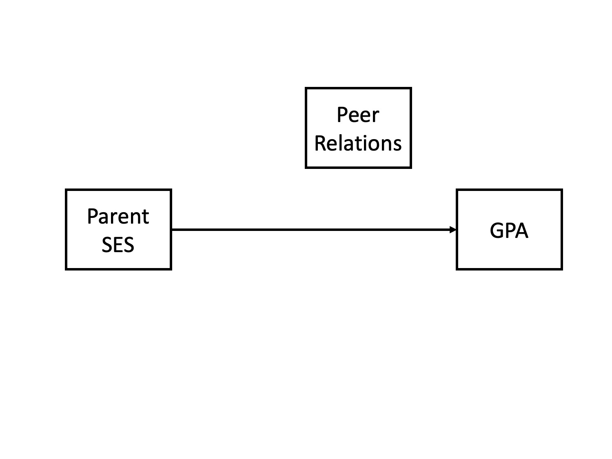
---
## Spurious relationship

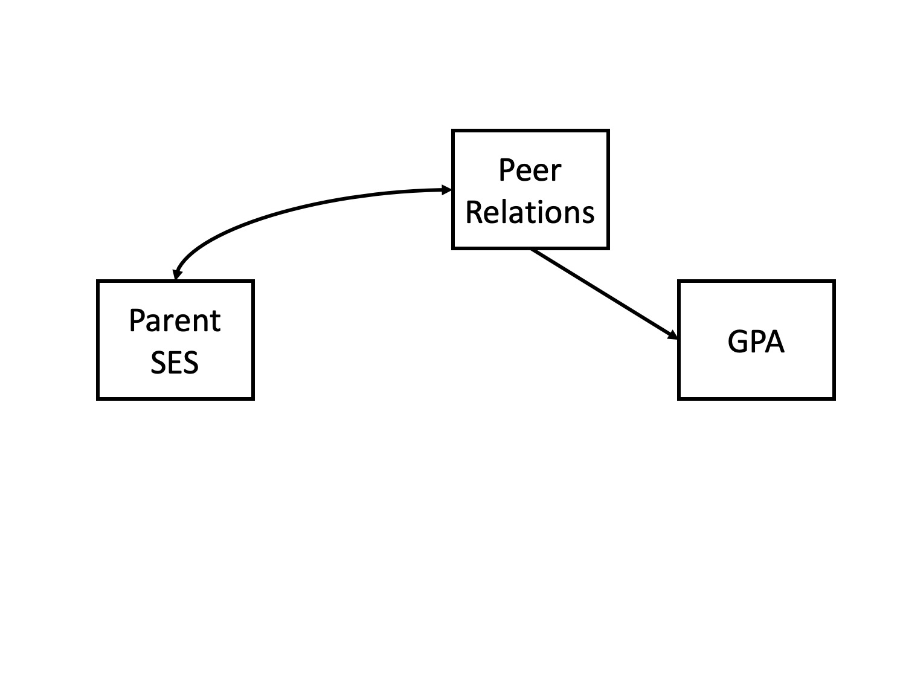


---
## Indirect (mediation)

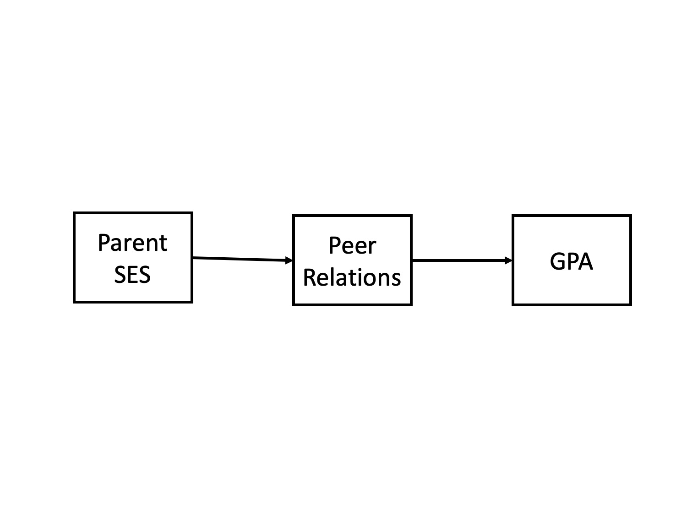


---
## Interaction (moderation)

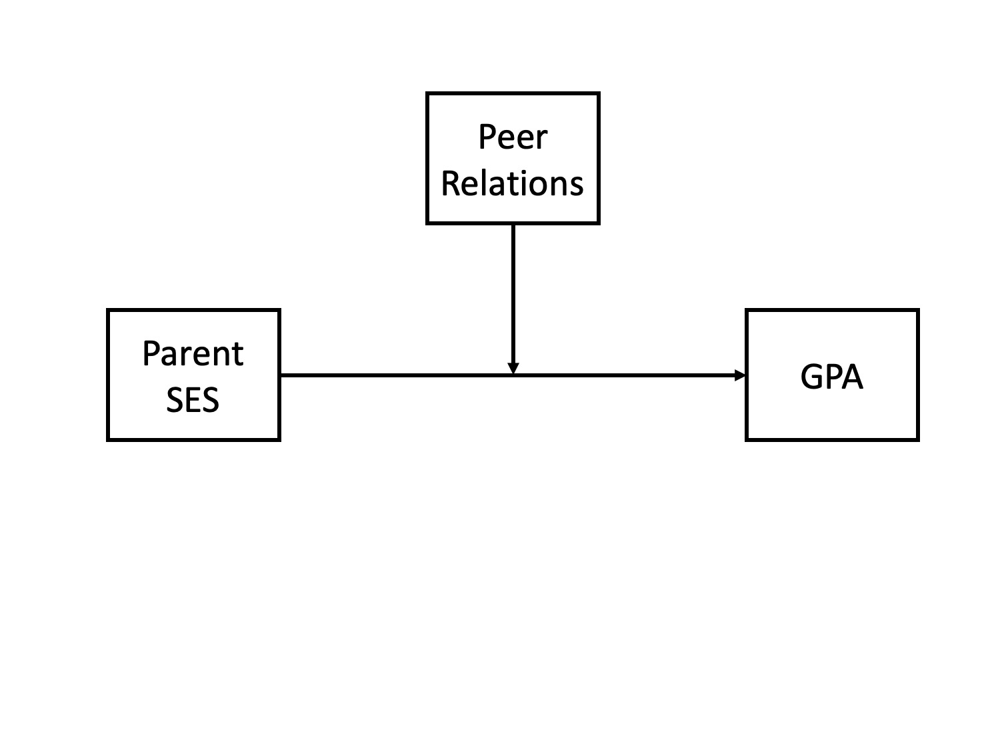


---
## Multiple causes

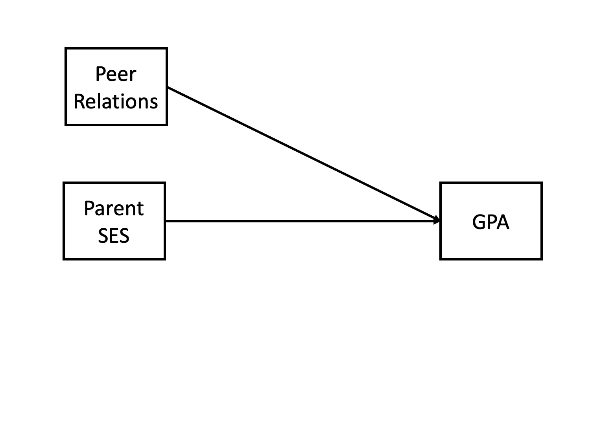


---
## Direct and indirect effects


---
### Multiple regression

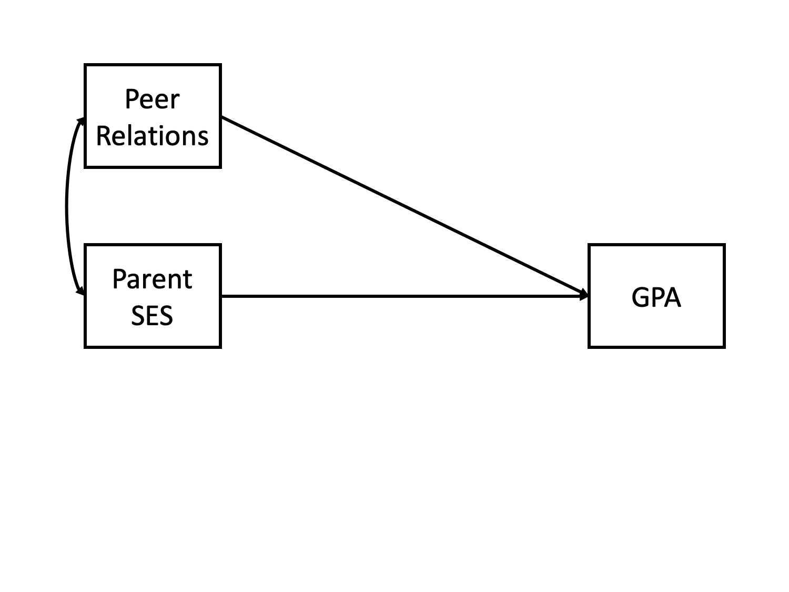
---
## General regression model


$$\large \hat{Y} = b_0 + b_1X_1 + b_2X_2 + \dots+b_kX_k$$

This is ultimately where we want to go. Unfortunately, it's not as simply as multiplying the correlation between Y and each X by the ratio of their standard errors and stringing them together. 

Why?

---

## What is $R^2$?

.pull-left[
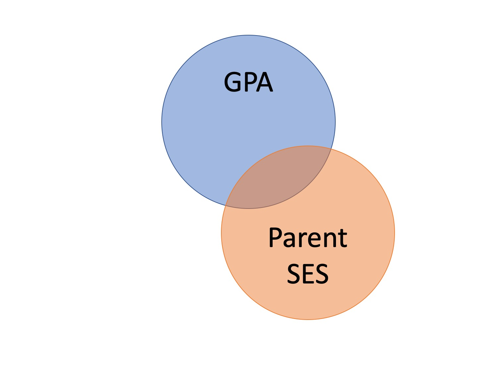
]
.pull-right[
$$\large R^2 = \frac{s^2_{\hat{Y}}}{s^2_Y}$$
$$\large R^2 = \frac{SS_{\text{Regression}}}{SS_Y}$$
]

---

## GPA = SES + Peer Relationships


???
can be thought of as overlapping venn diagrams

---


---


---

## What is $R^2$?

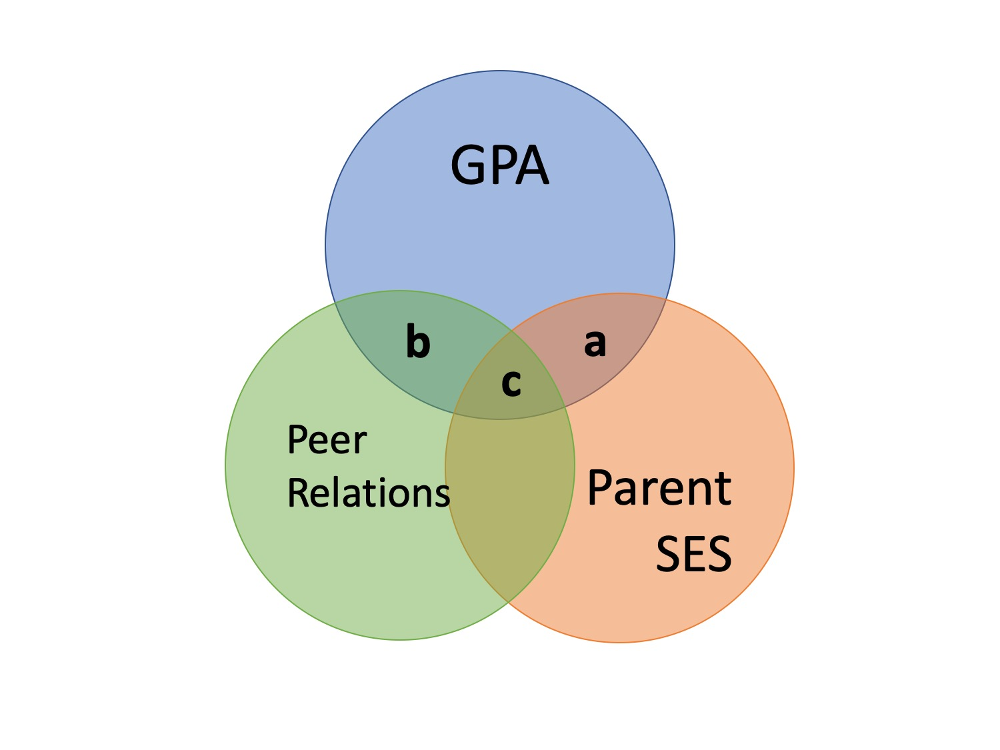
---
## What is $R^2$?

.pull-left[

]

.pull-right[
$\large R^2_{Y.12} = a + b + c$
]


---

## Types of correlations

Pearson product moment correlation
- Standard correlation measure
- Ignores all outside variables
- aka bi-variate correlation
- Zero-order correlation
- Only two variables are X and Y

---

## Semi-partial correlations


- This correlation assess the extent to which the part of $X_1$ *that is independent of* of $X_2$ correlates with *all* of Y

- This is often the estimate that we refer to when we talk about **controlling for** another variable.

- Notation: $sr$ or $r_{Y(1.2)}$; $sr^2$ is the semi-partial correlation, squared 
---

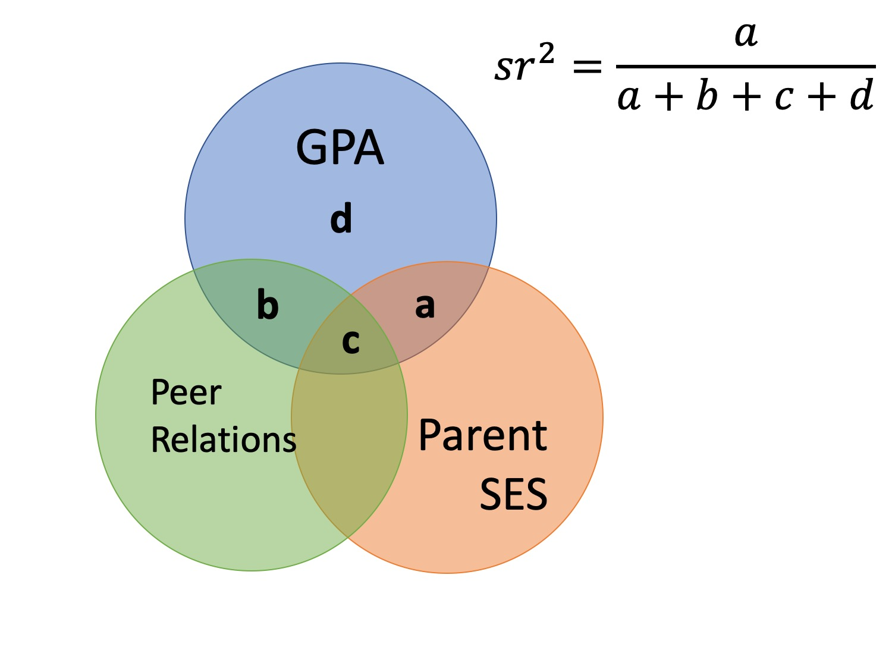

???

the semi-partial correlation between parent SES and GPA controlling for peer relationships is a (not c), divided by all of GPA

---
## Semi-partial correlations

$$\large sr_1 = r_{Y(1.2)} = \frac{r_{Y1}-r_{Y2}r_{12}}{\sqrt{1-r^2_{12}}}$$

$$\large sr_1^2 = R^2_{Y.12}-r^2_{Y2}$$
Notation:

- $R^2_{Y.12}$ is your standard $R^2$ -- variance explained in what is before the dot by what is after the dot. *"Variance explained in Y by X1 and X2"*

- $r_{Y(1.2)}$ is another way to write the semi-partial correlation. 
---

## Types of correlations

**Pearson product moment correlation**

**Semi-partial correlation**
- This correlation assess the extent to which the part of $X_1$ *that is independent of* of $X_2$ correlates with all of Y
- This is often the estimate that we refer to when we talk about **controlling for** another variable.
- Notation: $sr$ or $r_{Y(1.2)}$; $sr^2$ is the semi-partial correlation, squared 

--

**Partial correlation**
- The extent to which the part of $X_1$ *that is independent* of $X_2$ is correlated with *the part of Y that is also independent of* $X_2$. 
- Notation: $pr$ or $r_{Y1.2}$; $pr^2$ is the partial correlation, squared
---

## Partial Correlations

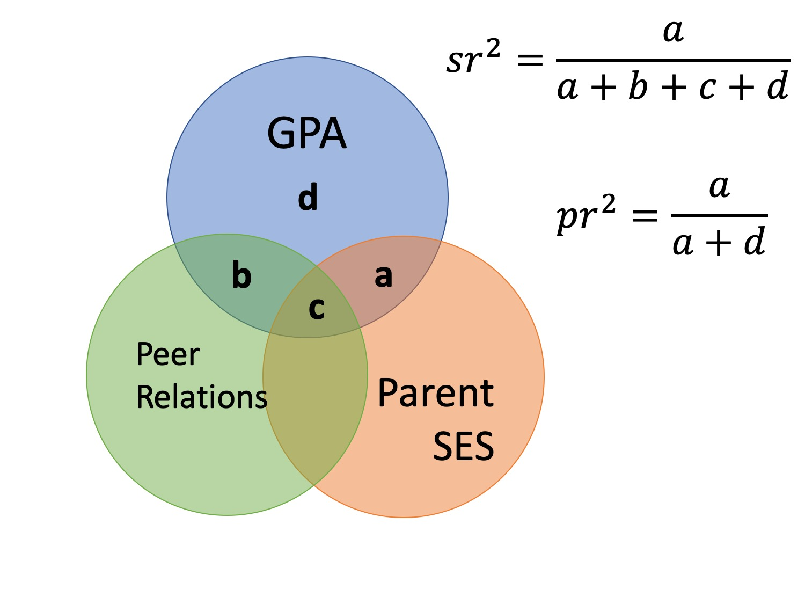
---

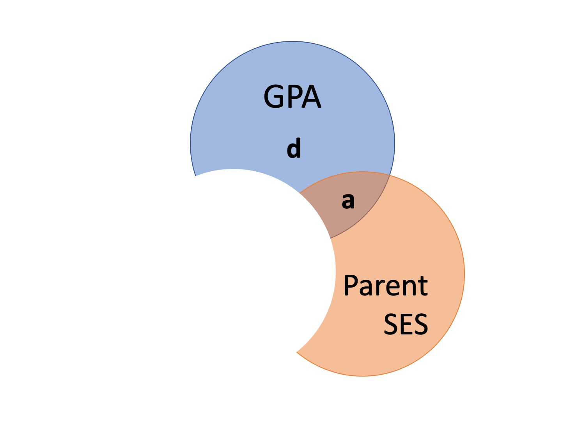
---
## Partial correlations

$$\large pr_1=r_{Y1.2} = \frac{r_{Y1}-r_{Y2}r_{{12}}}{\sqrt{1-r^2_{Y2}}\sqrt{1-r^2_{12}}} = \frac{r_{Y(1.2)}}{\sqrt{1-r^2_{Y2}}}$$
---

## Partial correlation

$$\large pr^2= \frac{R^2_{Y.12} - r^2_{Y2}}{\sqrt{1-r^2_{Y2}}}$$

$$\large sr^2 = R^2_{Y.12} - r^2_{Y2}$$
---

## What happens if X1 and X2 are uncorrelated?

.pull-left[
How does the semi-partial correlation compare to the zero-order correlation?
]

.pull-right[


]
---

## What happens if X1 and X2 are uncorrelated?

.pull-left[
How does the semi-partial correlation compare to the zero-order correlation?

$$\large r_{Y(1.2)} = r_{Y1}$$
]

.pull-right[


]
---

## What happens if X1 and X2 are uncorrelated?

.pull-left[
How does the semi-partial correlation compare to the zero-order correlation?

$$\large r_{Y(1.2)} = r_{Y1}$$
How does the partial correlation compare to the zero-order correlation?
]

.pull-right[


]
---

## What happens if X1 and X2 are uncorrelated?

.pull-left[
How does the semi-partial correlation compare to the zero-order correlation?

$$\large r_{Y(1.2)} = r_{Y1}$$

How does the partial correlation compare to the zero-order correlation?

$$\large r_{Y1.2} \neq r_{Y1}$$

]

.pull-right[


]

???
the latter is true bc you've removed variance in y...so there's no way for it to be true. specifically, you've removed b (c doesn't exist)


---

## When we use these?

The semi-partial correlation is most often used when we want to show that some variable adds incremental variance in Y above and beyond another X variable.

- e.g., predicting Alzheimer's

The partial correlations most often used when some third variable, Z, is a plausible explanation of the correlation between X and Y

- e.g., predicting grades

---

## Example

We have a dataset called `expertise` which measures a person's perception of their knowledge of personal finance (`self_perceived_knowledge`) and their performance on an objective measures of knowledge (`overclaiming_perception`). 

Participants also completed a test called the FINRA, which is an actual financial literacy test. 

```{r,  message = F}
library(here)
expertise = read.csv(here("data/expertise.csv"))
```

---

```{r, warning=FALSE, message=FALSE}
round(cor(expertise[,c("self_perceived_knowledge", "overclaiming_proportion", "FINRA_score")]), digits = 2)
library(ppcor)
round(spcor(expertise[,c("self_perceived_knowledge", "overclaiming_proportion", "FINRA_score")])$estimate, digits = 2)
```
???
spcor gets the semipartial correlation
---

```{r, warning=FALSE, message=FALSE}
round(cor(expertise[,c("self_perceived_knowledge", "overclaiming_proportion", "FINRA_score")]),2)
library(ppcor)
round(pcor(expertise[,c("self_perceived_knowledge", "overclaiming_proportion", "FINRA_score")])$estimate,2)
```

???
pcor gets partial cor

---

## Regression

Recall that the residuals of a univariate regression equation are the part of the outcome $(Y)$ that is independent of the predictor $(X)$.

$$\Large \hat{Y} = b_0 + b_1X$$
$$\Large e_i = Y_i - \hat{Y_i}$$
We can use this to construct a measure of $X_1$ that is independent of $X_2$:

$$\Large \hat{X}_{1.2} = b_0 + b_1X_2$$

$$\Large e_{X_1} = X_1 - \hat{X}_{1.2}$$

???
We run a regression where X2 predicts X1. then we take the error from that, which is the part of X1 that is independent of X2.
---

We can either correlate that value with Y, to calculate our semi-partial correlation:

$$\Large r_{e_{X_1},Y} = r_{Y(1.2)}$$

Or we can calculate a measure of Y that is also independent of $X_2$ and correlate that with our $X_1$ residuals.

$$\Large \hat{Y} = b_0 + b_1X_2$$

$$\Large e_{Y} = Y - \hat{Y}$$

$$\Large r_{e_{X_1},e_{Y}} = r_{Y1.2}$$

---

## Example

```{r}
# create measure of perceived knowledge *independent* of FINRA score
mod.know = lm(self_perceived_knowledge ~ FINRA_score, data = expertise)
expertise.know = broom::augment(mod.know)

# create measure of overclaiming independent of FINRA score
mod.over = lm(overclaiming_proportion ~ FINRA_score, data = expertise)
expertise.over = broom::augment(mod.over)

#semi-parital
cor(expertise.know$.resid, expertise$overclaiming_proportion)
#parital
cor(expertise.know$.resid, expertise.over$.resid)
```

---

## Who cares? Where are we going?

$$\large \hat{Y} = b_0 + b_{1}X_{1} + b_{2}X_{2} + ... + b_{p}X_{p}$$

- Regression coefficients are "partial" regression coefficients

- Predicted change in $Y$ for a 1 unit change in $X$ *holding all other predictors constant*

- Similar to semi-partial correlations -- represents part of each $X$

---

class: inverse

## Next time...

Multiple regression!!

#### Can you...

- interpret a partial correlation and a semi-partial correlation?
- think of scenarios where one is preferable to the other?
- you will get practice on this in the hw!