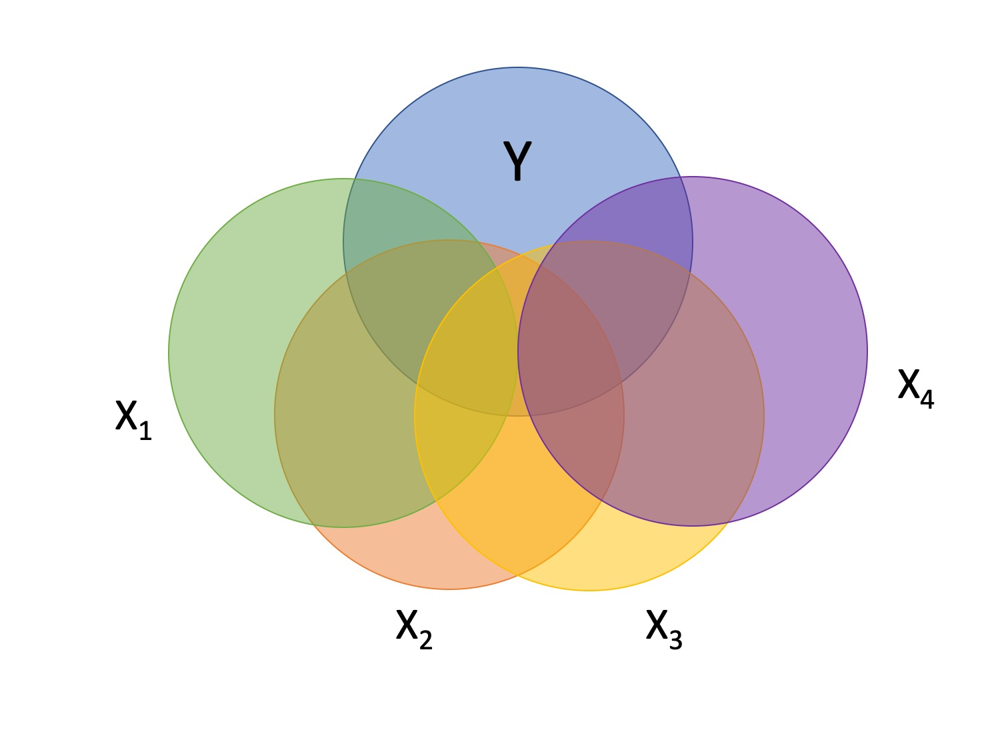

<style type="text/css">
.remark-slide-content {
    font-size: 30px;
    padding: 1em 4em 1em 4em;
}

.small .remark-code { 
  font-size: 80% !important;
}
.tiny .remark-code {
  font-size: 50% !important;
}

</style>

```{r xaringan-themer, include=FALSE, warning=FALSE}
library(xaringanthemer)
style_mono_accent(base_color = "#17139C",link_color = "#DD3E3E")

```

```{r, echo = F, warning = F, message = F}
library(tidyverse)
```

```{r, echo = FALSE, message=FALSE}
library(here)
nhanes = read.csv(here("data/nhanes_small.csv"))

summary(lm(Weight ~ Age + Poverty, data = nhanes))
```

- Interpret all coefficients
- Interpret all significance tests of coefficients
- Is it a good model?
---
## Last time

* Introduction to multiple regression
* Interpreting coefficient estimates
* Estimating model fit
* Significance tests (omnibus and coefficients)

---
## Today

* Tolerance
* Hierarchical regression/model comparison
* Categorical predictors

---

## The Data

```{r, message=FALSE}
stress.data = read.csv(here("data/stress.csv"))
library(psych)
describe(stress.data)
```

---

## The Model
```{r, output.lines = c(9:19)}
mr.model <- lm(Stress ~ Support + Anxiety, data = stress.data)
summary(mr.model)
```

???

Review here:
* Omnibus test
* Coefficient of determination
* Adjust R squared
* Resid standard error
* Coefficient estimates


---
### Standard error of regression coefficient

In the case of univariate regression:

$$se_{b} = \frac{s_{Y}}{s_{X}}{\sqrt{\frac {1-r_{xy}^2}{n-2}}}$$

In the case of multiple regression:

$$se_{b} = \frac{s_{Y}}{s_{X}}{\sqrt{\frac {1-R_{Y\hat{Y}}^2}{n-p-1}}} \sqrt{\frac {1}{1-R_{i.jkl...p}^2}}$$

- As N increases... 
- As variance explained increases... 

---
## Tolerance
$$se_{b} = \frac{s_{Y}}{s_{X}}{\sqrt{\frac {1-R_{Y\hat{Y}}^2}{n-p-1}}} \sqrt{\frac {1}{1-R_{i.jkl...p}^2}}$$

- what cannot be explained in $X_i$ by other predictors  

- large tolerance (little overlap) means standard error will be small.   

- what does this mean for including a lot of variables in your model? 

---

### Which variables to include

- Your goal should be to match the population model (theoretically)

- Including many variables will increase degrees of freedom and standard errors; in other words, putting too many variables in your model may make it _more difficult_ to find a statistically significant result 

- But that's only the case if you add variables unrelated to Y or X; there are some cases in which adding the wrong variables can lead to spurious results.
---

## Methods for entering variables

**Simultaneous**: Enter all of your IV's in a single model.
$$\large Y = b_0 + b_1X_1 + b_2X_2 + b_3X_3$$
  - The benefits to using this method is that it reduces researcher degrees of freedom, is a more conservative test of any one coefficient, and often the most defensible action (unless you have specific theory guiding a hierarchical approach).

---

### Methods for entering variables

$$\large Y = b_0 + e$$
$$\large Y = b_0 + b_1X_1 + e$$
$$\large Y = b_0 + b_1X_1 + b_2X_2 + e$$
$$\large Y = b_0 + b_1X_1 + b_2X_2 + b_3X_3 + e$$

This is known as **hierarchical regression**. Hierarchical regression is a subset of **model comparison** techniques. 

---

### Hierarchical regression / Model Comparison  

If we're comparing nested models by incrementally adding or subtracting variables, this is known as **hierarchical regression**. 

  - Multiple models are calculated  
    
  - Each predictor (or set of predictors) is assessed in terms of what it adds (in terms of variance explained) at the time it is entered   
    
  - Order is dependent on an _a priori_ hypothesis  


---



---
## R-square change
- distributed as an F
$$F(p.new, N - 1 - p.all) = \\  \frac {R_{m.2}^2- R_{m.1}^2} {1-R_{m.2}^2} (\frac {N-1-p.all}{p.new})$$
- can also be written in terms of SSresiduals

---
## Model comparisons
```{r}

m.1 <- lm(Stress ~ Support, data = stress.data)
m.2 <- lm(Stress ~ Support + Anxiety, data = stress.data)
anova(m.1, m.2)
```

---
## Model comparisons
```{r}
anova(m.1)
```


---
## Model comparisons
```{r}
anova(m.2)
```
---
## Model comparisons
```{r, echo = FALSE}
summary(m.2)
```
---
## Model comparisons
```{r, echo = FALSE}
summary(m.1)
```
---
## Model comparisons

```{r}
m.0 <- lm(Stress ~ 1, data = stress.data)
m.1 <- lm(Stress ~ Support, data = stress.data)
anova(m.0, m.1)
```


---
## Partitioning the variance
- It doesn't make sense to ask how much variance a variable explains (unless you qualify the association)

$$R_{Y.1234...p}^2 = r_{Y1}^2 + r_{Y(2.1)}^2 + r_{Y(3.21)}^2 + r_{Y(4.321)}^2 + ...$$

- In other words: order matters! 

---

### Categorical predictors

One of the benefits of using regression (instead of partial correlations) is that it can handle both continuous and categorical predictors and allows for using both in the same model.

Categorical predictors with more than two levels are broken up into several smaller variables. In doing so, we take variables that don't have any inherent numerical value to them (i.e., nominal and ordinal variables) and ascribe meaningful numbers that allow for us to calculate meaningful statistics. 

---

### Dummy coding

One group is selected to be a **reference** group. $K-1$ dummy coded variables are created; for each new dummy code variable, one of the non-reference groups is assigned 1; all other groups are assigned 0.

.pull-left[
| Occupation | D1 | D2 |
|:----------:|:--:|:--:|
|Engineer | 0 | 0 |
|Teacher | 1 | 0 |
|Doctor | 0 | 1 |

.tiny[The dummy codes are entered as IV's]
]

--

.pull-right[
|Person | Occupation | D1 | D2 |
|:-----|:----------:|:--:|:--:|
|Billy |Engineer | 0 | 0 |
|Susan |Teacher | 1 | 0 |
|Michael |Teacher | 1 | 0 |
|Molly |Engineer | 0 | 0 |
|Katie |Doctor | 0 | 1 |

]


---

### Solomon's Paradox
.small[
Describes the tendency for people to reason more wisely about other people’s
problems compared to their own. Maybe people tend to view
other people’s problems from a more psychologically distant perspective, whereas they view their own
problems from a psychologically immersed perspective. To test this possibility, researchers asked romantically-involved participants to think about a situation in which their partner cheated on them (*self* condition) or a friend’s partner cheated on their friend (*other* condition). Participants were also instructed to take a first-person perspective (*immersed* condition) by using pronouns such as I and me, or a third-person perspective (*distanced* condition) by using pronouns such as he and her.
]
 
.tiny[Grossmann, I., & Kross, E. (2014). Exploring Solomon’s paradox: Self-distancing eliminates self-other
asymmetry in wise reasoning about close relationships in younger and older adults. _Psychological Science, 25_, 1571-1580.]

---

```{r, results = 'hide', message = F, echo=FALSE}
library(here)
solomon = read.csv(here("data/solomon.csv"))

```

```{r}
psych::describe(solomon[,c("ID", "CONDITION", "WISDOM")], fast = T)
```

--
.pull-left[
```{r, table, results = 'asis', message=FALSE, warning=FALSE, eval = F}
library(knitr)
library(kableExtra)
head(solomon) %>% 
  select(ID, CONDITION, 
         WISDOM) %>%
  kable() %>% kable_styling()
```
]

.pull-right[
```{r, ref.label="table", echo = F, results = 'asis', message=FALSE, warning=FALSE}

```

]

---

```{r}
solomon = solomon %>%
  mutate(dummy_2 = ifelse(CONDITION == 2, 1, 0),
         dummy_3 = ifelse(CONDITION == 3, 1, 0),
         dummy_4 = ifelse(CONDITION == 4, 1, 0)) 
solomon %>% 
  select(ID, CONDITION, WISDOM,
         matches("dummy")) %>%
  kable(., "html") %>% kable_styling(full_width = FALSE, font_size = 13)
```

---

```{r}
mod.1 = lm(WISDOM ~ dummy_2 + dummy_3 + dummy_4, data = solomon)
summary(mod.1)
```

---
```{r}
summary(lm(WISDOM ~ CONDITION, data = solomon))

```

---
```{r}
solomon$CONDITION <- factor(solomon$CONDITION)
summary(lm(WISDOM ~ CONDITION, data = solomon))

```

---
### Interpreting coefficients

When working with dummy codes, the intercept can be interpreted as the mean of the reference group.

$$\begin{aligned} 
\hat{Y} &= b_0 + b_1D_2 + b_2D_3 + b_3D_2 \\
\hat{Y} &= b_0 + b_1(0) + b_2(0) + b_3(0) \\
\hat{Y} &= b_0 \\
\hat{Y} &= \bar{Y}_{\text{Reference}}
\end{aligned}$$

What do each of the slope coefficients mean?

---

From this equation, we can get the mean of every single group.

```{r}
newdata = data.frame(dummy_2 = c(0,1,0,0),
                     dummy_3 = c(0,0,1,0),
                     dummy_4 = c(0,0,0,1))
predict(mod.1, newdata = newdata, se.fit = T)
```

---

From this equation, we can get the mean of every single group.
```{r}
solomon %>% 
  mutate_at("CONDITION", ~as.factor(.)) %>% 
  group_by(CONDITION) %>% 
  drop_na() %>% 
  summarize(meanWisdom = mean(WISDOM))

```
---

And the test of the coefficient represents the significance test of each group to the reference. This is an independent-samples *t*-test.

The test of the intercept is the one-sample *t*-test comparing the intercept to 0.

```{r}
summary(mod.1)$coef
```

What if you wanted to compare groups 2 and 3?

---

```{r}
solomon = solomon %>%
  mutate(dummy_1 = ifelse(CONDITION == 1, 1, 0),
         dummy_3 = ifelse(CONDITION == 3, 1, 0),
         dummy_4 = ifelse(CONDITION == 4, 1, 0)) 
mod.2 = lm(WISDOM ~ dummy_1 + dummy_3 + dummy_4, data = solomon)
summary(mod.2)
```

---

We have to consider the correlations between the IVs, as highly correlated variables make it more difficult to detect significance of a particular X. One useful way to conceptualize the relationship between any two variables is "Does knowing someone's score on $X_1$ affect my guess for their score on $X_2$?"

Are dummy codes associated with a categorical predictor correlated or uncorrelated?

--

```{r}
cor(solomon[,grepl("dummy", names(solomon))], use = "pairwise")
```


---
### What do you think of this model?

```{r, echo=FALSE}
mod.3 = lm(WISDOM ~ CONDITION, data = solomon)
summary(mod.3)
```

---

### Omnibus test

```{r, highlight.output = 20:21, echo=FALSE}
summary(mod.1)
```
---

### Omnibus test
```{r, highlight.output = 20:21, echo=FALSE}
summary(mod.2)
```
---

### Omnibus test
```{r, highlight.output = 20:21, echo=FALSE}
summary(mod.3)
```
---

### Omnibus test
```{r}
anova(mod.3)
```

---
```{r, message = F, echo=FALSE}
library(here)
rotate = read.csv(here("data/pursuit_rotor.csv"))
head(rotate)
class(rotate$Group)
rotate$Group_lab = factor(rotate$Group, 
                          labels = c("Controllable\nPredictable", 
                                     "Uncontrollable\nPredictable",
                                     "Controllable\nUnpredictable",
                                     "Uncontrollable\nUnpredictable"))
```

```{r, echo=FALSE}
fit_1 = aov(Time ~ Group_lab, data = rotate)
summary(fit_1)
```

The $F$ statistic is highly unusual in the $F$ distribution, assuming the null hypothesis is true.  We reject the null hypothesis.


---
```{r, echo=FALSE}
fit_1 = aov(Time ~ Group_lab, data = rotate)
summary(fit_1)
```
We know the means are not equal, but the particular source of the inequality is not revealed by the $F$ test.

One simple way to determine what is behind the significant $F$ test is to compare each condition to all other conditions.

These pairwise comparisons can quickly grow in number as the number of conditions increases.  With 4 (k) conditions, we have k(k-1)/2 = 6 possible pairwise comparisons.

---

As the number of groups in the ANOVA grows, the number of possible pairwise comparisons increases dramatically. 


```{r,echo = F, fig.width = 10, fight.height = 6}
data.frame(g = 2:15) %>%
  mutate(num = (g*(g-1))/2) %>%
  ggplot(aes(x = g, y = num)) +
  geom_line(linewidth = 1.5) +
  geom_point(size = 3)+
  scale_x_continuous("Number of Groups in the ANOVA") +
  scale_y_continuous("Number of Pairwise Comparisons") +
  theme_bw(base_size = 16)
```

---

As the number of significance tests grows, and assuming the null hypothesis is true, the probability that we will make one or more Type I errors increases.  To approximate the magnitude of the problem, we can assume that the multiple pairwise comparisons are independent. The probability that we don’t make a Type I error for just one test is:

$$P(\text{No Type I}, 1 \text{ test}) = 1-\alpha$$
The probability that we don't make a Type I error for two tests is (note the reason we assume independence):

$$P(\text{No Type I}, 2 \text{ test}) = (1-\alpha)(1-\alpha)$$
---
For C tests, the probability that we make **no** Type I errors is

$$P(\text{No Type I}, C \text{ tests}) = (1-\alpha)^C$$
We can then use the following to calculate the probability that we make one or more Type I errors in a collection of C independent tests.

$$P(\text{At least one Type I}, C \text{ tests}) = 1-(1-\alpha)^C$$
As the number of comparisons grows, the inflation of the Type I error rate can be substantial.

**Family-wise Error Rate**

---

Need "correction" procedures. Many exist.

```{r,echo = F, fig.width = 10, fight.height = 6}
data.frame(g = 2:15) %>%
  mutate(num = (g*(g-1))/2,
         p_notype1 = (1-.05)^num,
         p_type1 = 1-p_notype1) %>%
  ggplot(aes(x = g, y = p_type1)) +
  geom_line(linewidth = 1.5) +
  geom_point(size = 3)+
  scale_x_continuous("Number of Groups in the ANOVA") +
  scale_y_continuous("Probability of a Type I Error") +
  theme_bw(base_size = 16)
```

---

Multiple comparisons, each tested with $\alpha_{per-test}$, increases the family-wise $\alpha$ level. 

$$\alpha_{family-wise} = 1 - (1-\alpha_{per-test})^C$$
Šidák showed that the family-wise $\alpha$ could be controlled to a desired level (e.g., .05) by changing the $\alpha_{per-test}$ to:

$$\alpha_{per-wise} = 1 - (1-\alpha_{family-wise})^{\frac{1}{C}}$$
Bonferroni (and Dunn, and others) suggested this simple approximation: 

$$\alpha_{per-test} = \frac{\alpha_{family-wise}}{C}$$

This is typically called the Bonferroni correction and is very often used even though better alternatives are available. 

---

```{r, warning = FALSE, message = FALSE}
library(rstatix)

rotate %>% 
  pairwise_t_test(Time ~ Group,
                  p.adjust.method = "bonferroni")
```

---

The Bonferroni procedure is conservative. The most common other one is the Holm procedure.

The Holm procedure does not make a constant adjustment to each per-test $\alpha$. Instead it makes adjustments in stages depending on the relative size of each pairwise p-value.

---

## Holm Procedure

1. Rank order the p-values from largest to smallest.
2. Start with the smallest p-value. Multiply it by its rank.
3. Go to the next smallest p-value. Multiply it by its rank. If the result is larger than the previous step, keep it. Otherwise replace with the previous step adjusted p-value.
4.  Repeat Step 3 for the remaining p-values.
5. Judge significance of each new p-value against $\alpha = .05$.

---
## Holm Procedure
```{r}

hp = rotate %>% 
  pairwise_t_test(Time ~ Group,
                  p.adjust.method = "holm") %>% 
  arrange(p) %>% 
  mutate(Rank = 6:1, rXp = Rank*p)

hp[,c(2,3,6:11)]

```
---

```{r, echo=FALSE}

hp = rotate %>% 
  pairwise_t_test(Time ~ Group,
                  p.adjust.method = "holm") %>% 
  arrange(p) %>% 
  mutate(Rank = 6:1, rXp = Rank*p)

hp[,c(2,3,6:11)]

```

A single adjusted per-test a would be used with the Bonferroni procedure: .05/6 = .0083. We would compare each original p-value to this new criterion and claim as significant only those that are less. Or, we could multiply the original p-values by 6 and judge them against a =.05.

---
class: inverse

## Next time...

Assumptions & Diagnostics of Regression


