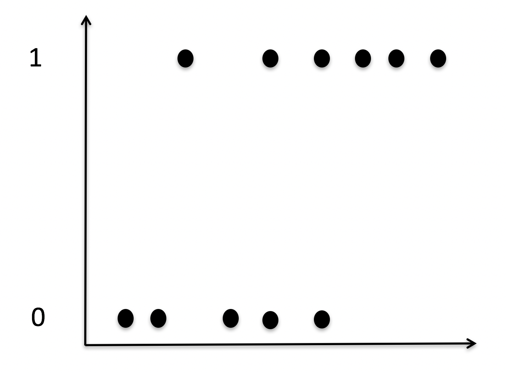
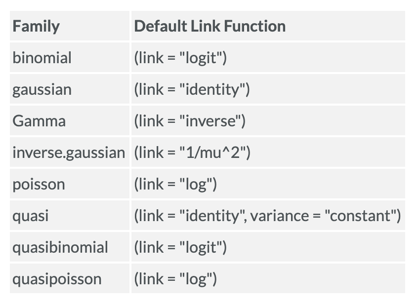

```{r xaringan-themer, include = FALSE}

hook_source <- knitr::knit_hooks$get('source')
knitr::knit_hooks$set(source = function(x, options) {
  x <- stringr::str_replace(x, "^[[:blank:]]?([^*].+?)[[:blank:]]*#<<[[:blank:]]*$", "*\\1")
  hook_source(x, options)
})

library(tidyverse)
library(broom)
```

<style type="text/css">
.remark-slide-content {
    font-size: 30px;
    padding: 1em 4em 1em 4em;
}

.small .remark-code { 
  font-size: 80% !important;
}
.tiny .remark-code {
  font-size: 65% !important;
}
</style>

## This whole semester...

- We've had continuous IVs (regression)

- We've had categoical IVs (factorial ANOVA)

- We've had a mixture of continuous/categorical IVs (more regression)

- .small[Please note that slide 41 of this presentation was edited on 4/19]

--
- But we've never had a DV variable that is categorical... in comes Logistic Regression


---

## Linear Regression

Let's take a step back and think about linear regression for a minute:

-  When we have a continuous DV, we can...
  -   Calculate the $R^2$ and determine if our IVs & DV are correlated  (large value implying = large effect)
  -   Calculate a $p$-value to determine if $R^2$ (or our model) is statistically significant  
  -   Use the line/slope of a linear regression to make a calculated prediction of *y* given *x*
  -   Compare models
  - Add in predictors & look at interactions

---

## Logistic Regression

Logistic Regression does something entirely different...


When we have a categorical DV, we are trying to see if something is *TRUE* or *FALSE* rather than trying to understand or predict something on a continuous scale.


---

## Logistic Regression

Used when your DV is binary (0,1)  
- Clinical diagnosis   
- Disease prevalence    
- Experiences (Yes/No)
- Correct/Incorrect

--

The mean of the distribution is the same as the proportion of 1's in the distribution. 
- Out of 100 people, 27 have PTSD (1) and 73 do not have PTSD (0)
- The mean of the distribution is .27
- Probability of getting a 1 is .27

---

.left-column[ 
If we plotted these points, they are either 1's or 0's. Looks like this...
]
```{r out.width = '75%', echo = FALSE}


```


---
.left-column[
If we plotted our OLS regression line, we get this. But it doesn't make sense! Predicted values can go above 1 or below 0...yikes
]
```{r out.width = '75%', echo = FALSE}

knitr::include_graphics("images/Log.2.png")
```

---
.left-column[
Instead, we fit this non-linear function. None of our data fall on the line!   
]
```{r out.width = '75%', echo = FALSE}

knitr::include_graphics("images/Log.3.png")
```

---

## Where is the line??

Logistic Regression, rather than a straight, fitted line like linear regression, logistic regression fits an S-shaped logistic function.

This curved line can tell us the probability that something will be "1" given *X*

---

## Model Complexity

...and just like linear regression, we can make simple models (a relationship between *x* and *y*, with *y* being a binary variable) or more complicated models (with covariates).

Unlike linear regression, it isn't as easy to just compare a more complex model to a simple model. Rather, we will want to do what is called a *Wald's Test* to find out if our prediction is significantly different from 0 (more on this later!).

---

## Assumption violations

When our outcome is binary, we violate OLS regression assumptions
    
Violates:      
- Correctly specified form  (not linear)
- Homoscedasticity (as probability approaches 1 or 0, variance approaches 0)
- Normality of the errors (lol not close)


---

## Need to think in terms of probabilities

- If we use OLS, we violate assumptions and have predicted values that go outside 0 & 1   
- How does the predicted probability of getting a 0 or a 1 relate to our predictors?       

$$\hat{p}_{i} \leftrightsquigarrow b_{0} + b_{1}X_{1} + b_{2}X_{2}... b_{3}X_{p}$$

---
## Generalized linear models 

- Extends the general linear model framework

- Used to describe different Data Generating Processes (DGPs) other than Gaussian normal

- Need to use if we cannot use the Gaussian normal e.g. the range of Y is restricted (e.g. binary, count) and/or the variance of Y depends on the mean, etc...

- In other words, what is your DGP?

---
## Generalized linear models 
.pull-left[
- Gaussian model is 
$$y_i \sim  N(\mu_i, \sigma)$$

$$\mu_i = \alpha + \beta x_i$$
- The parameters of the normal distribution are the mean μ and the standard deviation σ (or the variance $\sigma^2$)]

.pull-right[
- Binomial outcome is
$$y_i \sim  Binomial(n, p_i)$$

$$f(p_i) = \alpha + \beta x_i$$
- **n** stands for the number of times the experiment runs.
- **_p_** represents the probability of one specific outcome.]

---
## GLM components

It is not common to have an average outcome $\mu$ (other than in a normal distribution) and it is not common to have parameters range from negative to positive infinity. We need something that translates our model into the parameters that describe the distribution.  

---
## Logistic regression

.pull-left[
$$y_i \sim  Binomial(n, p_i)$$

$$f(p_i) = \alpha + \beta x_i$$
 
Our number of trials is $N$, so we are predicting the probability of $y$. Probabilities are bounded between zero and one. 
]

.pull-right[
Because our variables are not in probability units we need to "link" them via a function. The linear right side of the equation is not in the same units as the non-linear left side. 
 
Two most popular are logit and log. Others are available too, such as probit.
]

---
## Link function for logistic

- We need to map (0,1) to $(-\infty, \infty)$

- Logistic regression uses the logistic function to link the predicted probabilities to the predictors   

- Think of it as a transformation of $\hat{Y}$s

---
## Sigmoid function

.pull-left[
$$f(x) = \frac{1}{1+e^{-X}}$$

... where $e$ is Euler's number


```{r}
exp(1)
```
]


.pull-right[
```{r out.width = '80%', echo = FALSE}

knitr::include_graphics("images/Log.4.png")
```

The y-axis is the "rolling mean" of the DV (or the proportion of 1's). This logistic curve relates $X$ (the IV) to our $P(\bar{Y})$
]

---
## Sigmoid function (cont.)

For the Sigmoid function, as *x* approaches $\infty$, it reaches a natural limit at 1.

As *x* approaches $-\infty$, it reaches a natural limit of 0

This all keeps the limits within the 0, 1 range.

---
$$f(x) = \frac{1}{1+e^{-X}}$$
$$\hat{p} = \frac{1}{1+e^{-b_{0}+b_{1}X}}$$
- The form of the logistic function is still nonlinear (because probabilities can only range from 0 to 1)  

- Since it's nonlinear, $b$ can't be interpreted as easily as we've been doing with OLS regression.

- So in order to interpret our model parameter, we need to conver to **odds**

???
where P is the probability of a 1 (the proportion of 1s, the mean of Y), e is the base of the natural logarithm (about 2.718) and a and b are the parameters of the model. The value of a yields P when X is zero, and b adjusts how quickly the probability changes with changing X a single unit (we can have standardized and unstandardized b weights in logistic regression, just as in ordinary linear regression). Because the relation between X and P is nonlinear, b does not have a straightforward interpretation in this model as it does in ordinary linear regression

---
## Odds

- Odds are defined as the probability of being a case divided by the probability of being a noncase
- Not bound between 0 and 1 
- Range from 0 to infinity
- Less than one is less than 50% probability
$$odds = \frac {\hat{p}}{1-\hat{p}}$$

$$probability= \frac{\hat{odds}}{1+\hat{odds}}$$
---
## Odds versus Probability

Put simply:

- Odds are the ratio of something happening over something not happening.
- Probability is the ratio of something happening over everything that could happen.

The odds being so asymmetrical (unlike probability) make it difficult to compare the odds of being 0 versus the odds of being 1. So we use something called log odds.

---
## Log Odds

Taking the log of the odds solves this problem by making everything symetrical!

Odds are 1 to 6:

- log(1/6) = log(0.17) = -1.79

Odds are 6 to 1:

- log(6/1) = log(6) = 1.79


---
## Linear Probability Model

$$f(x) = \frac{1}{1+e^{-X}}$$
$$\hat{p} = \frac{1}{1+e^{-b_{0}+b_{1}X}}$$

$$odds = \frac {\hat{p}}{1-\hat{p}}=e^{b_{0}+b_{1}X}$$
$$logit= Log(odds)=ln(\frac{\hat{p}}{1-\hat{p}}) = b_{0}+b_{1}X$$

---
## Logit
$$logit= Log(odds)=ln(\frac{\hat{p}}{1-\hat{p}}) = b_{0}+b_{1}X$$
- DV is a logit, the natural log of odds

- Predicted scores are not dichotomous   

- Instead of predicting probabilities directly, we are instead predicting the log of the odds.

- The regression we are used to is not predicting $\hat{Y}$, because we're predicting (or relating our IV) *logits*

---

## Now what?

- In order to get the probability of a value of X being 1 or 0 based on some model parameters ( $b_0$, $b_1$ etc. ), we rearrange our equation so that we actually get the predicted logit (log of odds) given our model parameters. 

- How the hell do you interpret a logit? Not easily...

- Convert back into odds

- Convert your odds back into probabilities

---
## Estimation with Maximum Likelihood

- OLS minimizes the errors ( $SS_{res}$), which maximizes ( $SS_{reg}$)   
- In logistic regression we are not so lucky  

- Need to rely on iterative procedure, ML Estimation:

  - Pick parameters of your model ( $b_0$, $b_1$ etc. ), and calculate the *likelihood* of the data, given those parameters. We do this iteratively until we find the best parameters -- the ones that *maximize* the *likelihood* of your data. 

---
## Estimation with Maximum Likelihood

More simply, we can think about using the distribution of the data to find the location that maximizes the likelihood of observing the variable that we measured. We are essentially trying to find the optimal value for the mean (or standard deviation) for a distribution giving our observed data.

We are talking here about the mean of the distribution, not the mean of the data. (However, in a normal distribution, these are the same thing.)

---
## Estimation with Maximum Likelihood

- So we get model parameters, estimated via MLE (instead of OLS)

- Same but different:

  - Asymptotic standard errors (an approximation to the standard error)  

  - Interpret test statistics as $z$’s, not $t$’s  

  - No $t$-tests; instead a Wald test = $\chi^2$ test with 1 df = $(\frac{coef}{se})^2$

???
asymptotic se's are just approximations since we finite-sample dist of the estimator isn't known

---
## GLM in R

.pull-left[
```{r, eval=FALSE}

glm(formula,
    family = gaussian(link="identity"), #<<
    data,
    weights,
    subset,
    na.action,
    start = NULL,
    etastart,
    mustart,
    offset, 
    control = glm.control(...),
    model = TRUE,
    method = ”glm.fit”,
    x = FALSE, 
    y = TRUE,
    contrasts = NULL, ...)
```
]

.pull-right[
The `family` argument specifies the distribution. In R, families have default links. 


]

---
## GLM in R

.pull-left[
```{r, eval=FALSE}

glm(y ~ X1+ X2 + X3 , #<<
    family = binomial,
    data = dataset)

```
]

.pull-right[
Specify the model like you would with `lm`
]

---
## GLM in R

.pull-left[
```{r, eval=FALSE}

glm(y ~ X1+ X2 + X3 , 
    family = binomial, #<<
    data = dataset)

```
]

.pull-right[

Specify the distribution you're working with. When binary outcomes, we'll use the binomial. 

]

---
## GLM in R

.pull-left[
```{r, eval=FALSE}

glm(y ~ X1+ X2 + X3 , 
    family = binomial, 
    data = dataset) #<<

```
]

.pull-right[

Specify your dataset.

]

---
## How to interpret
- $b_1$ is the predicted change in the logit for a 1-unit change in X, holding the other predictors constant 

- For a 1-unit change in X, holding other predictors constant, the odds that Y = 1 changes by $e^{b_{1}}$   

  - e.g,. $b_{1}$ = .4, $e^{.4}$ = 1.49 

- For fitted values, need to use entire equation
$\hat{Y} = e^{b_{0}+b_{1}X_{1}}$

- Turn to probabilities by: $\frac{\text{odds}}{(1 + \text{odds})}$

---
## Example

```{r, echo = FALSE, warning=FALSE, message=FALSE}
library(readr)
Personality_longevity <- read_csv("https://raw.githubusercontent.com/josh-jackson/5067-Spring-2020/master/static/Lectures/Personality_longevity.csv")

library(dplyr)
mortality <- Personality_longevity %>% 
  select (Time, Intelligence_Self, Intelligence_Mate) %>% 
  mutate(premature.d = cut(Time, breaks=c(-Inf, 62, Inf),
                     labels=c("premature","normal"))) %>% 
  select(-Time)
  
mortality$NOT.premature <- dplyr::recode(mortality$premature.d, normal ="1", premature="0")
  
mortality$NOT.premature <- as.numeric(as.character(mortality$NOT.premature ))


  
```

```{r}
# 1 = not premature
mortality
```

---

```{r}

death.1 <- lm(NOT.premature ~ Intelligence_Self , data = mortality)
summary(death.1)
```


---

```{r}

death.2 <- glm(NOT.premature ~ Intelligence_Self , data = mortality)
summary(death.2)
```


---
```{r}
anova(death.1)
```

---
```{r}
anova(death.2)
```

---

```{r}
death.3 <- glm(NOT.premature ~ Intelligence_Self,
               family = binomial, data = mortality)
summary(death.3)
```

---
### Slide corrected on 4/19

For a 1-unit change in X, holding other predictors constant, the odds that Y = 1 changes by $e^{b_{1}}$

```{r}
exp(1)^.08012
```

*For every 1-unit increase in Intelligence, the odds of living increase by 8%*


---

## Specific Values?

What if you want the probability of being a premature death for a given level of Intelligence? (Now that we've run our model and have parameters...)

For fitted values, need to use entire equation
$\hat{Y} = e^{b_{0}+b_{1}X_{1}}$

```{r}
# get fitted value with a given value of X (here 20)
exp(1)^(0.28695 + (.08012*20))
 
# now get odds
6.615067 / (1+6.615067)
```

---
## Probit 

We can have different link functions. When your response variable (DV) is truly binary -- the data generating process generates legit binary data -- logit is your pick.

--

What if your response variable is binary, but the underlying construct you are trying to measure is likely Gaussian? Ex: depressed vs. not depressed. But the underlying latent construct is continuous. More appropriate then is the **probit** link function.

[Stack exchange thread if you're going down this route](https://stats.stackexchange.com/questions/20523/difference-between-logit-and-probit-models)
---
## Probit


```{r}
death.4 <- glm(NOT.premature ~ Intelligence_Self,
        family = binomial(link = "probit"), data = mortality)
summary(death.4)
```


---
class:inverse

## 4 more to go... 

- 3 talks on Machine Learning principles
- 1 review session
- 1 last exam!


