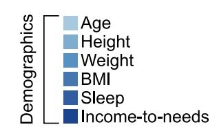
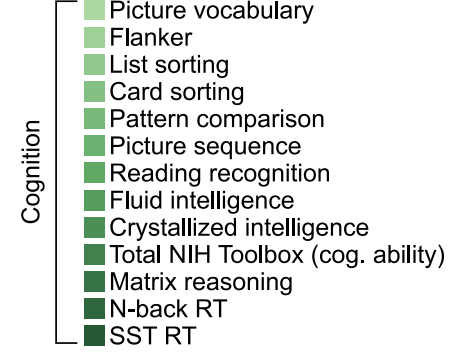
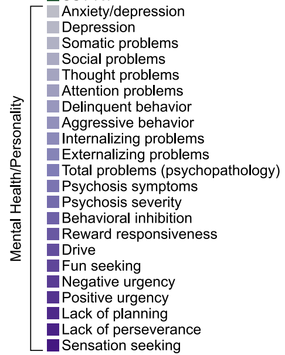

```{r xaringan-themer, include=FALSE, warning=FALSE}
library(xaringanthemer)
style_mono_accent(base_color = "#17139C",link_color = "#DD3E3E")

```

```{r packagesAndData, include=FALSE, warning=FALSE}
library(tidyverse)
library(ggpubr)
library(knitr)
library(kableExtra)
library(palmerpenguins)
colors = RColorBrewer::brewer.pal(4, "Set2")
```

```{r setup, include=FALSE}
knitr::opts_chunk$set(echo = TRUE)
```


## Last time

* Resampling Methods
* Machine Learning
* Qualitative Methods

--

## This time

* Principal Components Analysis
* Much of this was taken from the [ISLR textbook](https://www.statlearning.com/)

---

## Goals for today

- Why use PCA
- What is the general idea for PCA
- Compare/Contrast with Factor Analysis

---

## The Problem

- You work with a lot of variables
- These variables are highly correlated

--

- What is this called?
- What's the problem with it?

---
.pull-left[


]

.pull-right[

]

.small[ABCD study; Marek et al., 2022]

If you wanted to visualize these 41 measures you'd need 820 bivariate scatterplots

???
p(p-1)/2 where p = number of measures

---

## PCA

What do we want?

- low-dimensional representation of the data...not 41 measures

- must capture as much information as possible! 

- then we can use these reduced "components" for plotting or for subsequent analyses like regression!

---

## PCA

#### PCA is a method for re-expressing a set of variables

- Converting a large set of variables to a smaller number of **linear combinations that contain** *most* of the original information

- Exploring the dimensionality in the dataset

- Eliminating multicollinearity in a set of predictors

---

## PCA Geometry/Visualized

```{r, echo=FALSE}
library(palmerpenguins)
library(ggplot2)
library(GGally)

penguins_sub <- penguins[, c("bill_length_mm", "flipper_length_mm", "body_mass_g")]
penguins_sub <- na.omit(penguins_sub)

ggpairs(
  penguins_sub,
  upper = list(continuous = wrap("cor", size = 5)),
  lower = list(continuous = wrap("points", alpha = 0.4, size = 1.5, color = "#DD3E3E")),
  diag  = list(continuous = wrap("densityDiag", fill = "#DD3E3E", alpha = 0.5))
) +
  theme_bw(base_size = 14) +
  labs(title = "UNSTANDARDIZED Bivariate relationships among penguin")

```

---

## PCA Geometry/Visualized

```{r, echo=FALSE}
library(palmerpenguins)
library(ggplot2)
library(GGally)

penguins_sub <- penguins[, c("bill_length_mm", "flipper_length_mm", "body_mass_g")]
penguins_sub <- na.omit(penguins_sub)

penguins_sub <- as.data.frame(scale(penguins_sub))

ggpairs(
  penguins_sub,
  upper = list(continuous = wrap("cor", size = 5)),
  lower = list(continuous = wrap("points", alpha = 0.4, size = 1.5, color = "#DD3E3E")),
  diag  = list(continuous = wrap("densityDiag", fill = "#DD3E3E", alpha = 0.5))
) +
  theme_bw(base_size = 14) +
  labs(title = "Bivariate relationships after z-scoring")
```

---

## PCA Geometry/Visualized

```{r, echo=FALSE, warning=FALSE, message=FALSE}
library(palmerpenguins)
library(ggplot2)
library(reshape2)

penguins_sub <- penguins[, c("bill_length_mm", "flipper_length_mm", "body_mass_g")]
penguins_sub <- na.omit(penguins_sub)
penguins_scaled <- as.data.frame(scale(penguins_sub))

cov_matrix <- cov(penguins_scaled)

cov_melted <- melt(cov_matrix)
colnames(cov_melted) <- c("Var1", "Var2", "value")

var_order <- c("body_mass_g", "flipper_length_mm", "bill_length_mm")
cov_melted$Var1 <- factor(cov_melted$Var1, levels = var_order)
cov_melted$Var2 <- factor(cov_melted$Var2, levels = rev(var_order))

ggplot(cov_melted, aes(x = Var1, y = Var2, fill = value)) +
  geom_tile(color = "white", linewidth = 0.8) +
  geom_text(aes(label = round(value, 2)), size = 5, fontface = "bold") +
  scale_fill_gradient2(
    low = "white", mid = "#f5c5c5", high = "#DD3E3E",
    midpoint = 0.5, limits = c(0, 1),
    name = "Covariance"
  ) +
  scale_x_discrete(labels = c("Body mass", "Flipper length", "Bill length")) +
  scale_y_discrete(labels = c("Bill length", "Flipper length", "Body mass")) +
  labs(
    title = "Variance-covariance matrix of z-scored variables",
    subtitle = "Diag = var (= 1 after scaling). Off-diag = covar (= r)",
    x = NULL, y = NULL
  ) +
  theme_bw(base_size = 14) +
  theme(axis.text.x = element_text(angle = 25, hjust = 1))

```

---

## Now what? -- Eigendecomposition

What linear combination of these 3 variables captures the most variance?

1. Get a weighted sum of our 3 variables. Choose the weights to **maximize variance**

2. Do it again. Get a second weighted sum. But now, make sure that these weights are completely uncorrelated ( **orthogonal** ) to the first set.

--

- The weights are our **loadings** (aka eigenvectors)
- The **components** is the weighted sum of our original variables
- How much of the total variance does each component capture? (eigenvalue)

---

```{r, echo=FALSE}
library(palmerpenguins)
library(ggplot2)

penguins_sub <- penguins[, c("bill_length_mm", "flipper_length_mm", "body_mass_g")]
penguins_sub <- na.omit(penguins_sub)
penguins_scaled <- as.data.frame(scale(penguins_sub))

pca_2d <- prcomp(penguins_scaled[, c("bill_length_mm", "flipper_length_mm")])

# PC1 direction vector
pc1 <- pca_2d$rotation[, 1]
slope_pca <- pc1[2] / pc1[1]

ggplot(penguins_scaled, aes(x = bill_length_mm, y = flipper_length_mm)) +
  geom_point(alpha = 0.4, size = 1.8, color = "gray50") +
  geom_abline(slope = slope_pca, intercept = 0,
              color = "#DD3E3E", linewidth = 1.2) +
  labs(
    title = "PC1 as the axis of maximum variance",
    subtitle = "Red line = first principal component",
    x = "Bill length (z-scored)",
    y = "Flipper length (z-scored)"
  ) +
  coord_fixed() +
  theme_bw(base_size = 14)
```

.small[Not quite OLS but looks similar! OLS uses vertical distance between points and line. PCA minimizes perpendicular distances between points and line --  no distinction between predictor and outcome] 

---
```{r, echo=FALSE}
library(palmerpenguins)
library(ggplot2)

penguins_sub <- penguins[, c("bill_length_mm", "flipper_length_mm", "body_mass_g")]
penguins_sub <- na.omit(penguins_sub)
penguins_scaled <- as.data.frame(scale(penguins_sub))

pca_2d <- prcomp(penguins_scaled[, c("bill_length_mm", "flipper_length_mm")])

pc1 <- pca_2d$rotation[, 1]
pc2 <- pca_2d$rotation[, 2]

slope_pc1 <- pc1[2] / pc1[1]

scores_pc2 <- as.matrix(penguins_scaled[, c("bill_length_mm", "flipper_length_mm")]) %*% pc2
pc2_range <- range(scores_pc2)

pc2_x <- pc2[1] * pc2_range
pc2_y <- pc2[2] * pc2_range

ggplot(penguins_scaled, aes(x = bill_length_mm, y = flipper_length_mm)) +
  geom_point(alpha = 0.4, size = 1.8, color = "gray50") +
  geom_abline(slope = slope_pc1, intercept = 0,
              color = "#DD3E3E", linewidth = 1.2) +
  annotate("segment",
           x = pc2_x[1], y = pc2_y[1],
           xend = pc2_x[2], yend = pc2_y[2],
           color = "#17139C", linewidth = 1.2) +
  labs(
    title = "PC1 and PC2 as orthogonal axes through the data",
    subtitle = "Red = PC1 (max var)  |  Blue = PC2 (orthogonal, remaining var)",
    x = "Bill length (z-scored)",
    y = "Flipper length (z-scored)"
  ) +
  coord_fixed() +
  theme_bw(base_size = 14)

```

.small[**Orthogonality**: Axes are 90deg angle so linearly uncorrelated. Each PC captures independent, non-overlapping variance; no more multicollinearity!]

---

## Interim Summary

### What did we do?

- We took our standardized variables

- We found the axis that maximizes variance, and then the next orthogonal axis that maximizes variance (for however many variables you have)

- Started with 3 variables, but then only showed 2 so that I could do this with scatterplots (could have done with 3D plots but that's hard to read!)

- We did this via eigendecomposition (trust me). It gives us weights/loadings so that we can simply do this via linear combinations

---
## Interim Summary

### Why

- We have 41 variables, but only 4 principal components explain most of the variance!

- Transform our original data into linear combinations reflecting just those 4 components. 

- No longer in z-score units. Data are projected into PC space. Interpretation of raw numbers is hard. However, the relationship is preserved. A penguin that was large in OG units is still large in PC space.

- BUT! I'm only down to 4 PCs. I no longer have 41 variables to work with, I'm down to 4. Goodbye multicollinearity!
---
## Output
```{r}
library(palmerpenguins)

penguins_sub <- penguins[, c("bill_length_mm", "flipper_length_mm", "body_mass_g")]
penguins_sub <- na.omit(penguins_sub)
penguins_scaled <- as.data.frame(scale(penguins_sub))

pca <- prcomp(penguins_scaled)
pca
```

---

## Output
```{r}
head(pca$x)
```

---
## PC Scores -- linear combinations

$$\small PC1_i = w_1 \cdot billLength_i + w_2 \cdot flipperLength_i + w_3 \cdot bodyMass_i $$

- Take penguin 1's score
- Multiply it by weight

```{r}
penguin_1 <- as.numeric(penguins_scaled[1, ])
loadings_pc1 <- pca$rotation[, 1]

manual_score <- sum(penguin_1 * loadings_pc1)
manual_score

# verify it matches prcomp output
pca$x[1, 1]
```
 
---
## PC Scores -- linear combinations

$$\small PC1_i = w_1 \cdot billLength_i + w_2 \cdot flipperLength_i + w_3 \cdot bodyMass_i $$

Multiply each z-scored variable by its corresponding loading, then sum all 3 products. This is the number where that penguin (observation) sits along the PC1 axis.

Do it again with the PC2 loadings and that's where it sits along the PC2 axis.

We like to project/plot these against each other -- **biplot**

---
```{r,echo=FALSE, fig.height=5}
library(palmerpenguins)
library(ggplot2)

penguins_sub <- penguins[, c("bill_length_mm", "flipper_length_mm", "body_mass_g")]
penguins_sub <- na.omit(penguins_sub)
penguins_scaled <- as.data.frame(scale(penguins_sub))
pca <- prcomp(penguins_scaled)

scores <- as.data.frame(pca$x)
loadings <- as.data.frame(pca$rotation)
loadings$variable <- rownames(loadings)

arrow_scale <- 2.5

ggplot(scores, aes(x = PC1, y = PC2)) +
  geom_point(alpha = 0.4, size = 1.8, color = "#DD3E3E") +
  annotate("segment",
           x = 0, y = 0,
           xend = loadings$PC1 * arrow_scale,
           yend = loadings$PC2 * arrow_scale,
           arrow = arrow(length = unit(0.25, "cm")),
           color = "black", linewidth = 0.8) +
  annotate("text",
           x = loadings$PC1 * arrow_scale * 1.15,
           y = loadings$PC2 * arrow_scale * 1.15,
           label = loadings$variable,
           size = 4.5) +
  geom_hline(yintercept = 0, linetype = "dashed", color = "#DD3E3E", linewidth = 0.8) +
  geom_vline(xintercept = 0, linetype = "dashed", color = "#DD3E3E", linewidth = 0.8) +
  labs(
    title = "Biplot: PC1 is the axis of maximum variance",
    x = paste0("PC1 (", round(summary(pca)$importance[2,1]*100, 1), "% variance explained)"),
    y = paste0("PC2 (", round(summary(pca)$importance[2,2]*100, 1), "% variance explained)")
  ) +
  theme_bw(base_size = 14)
```

Each point is a penguin in PC space. If PC1 reflects "body size" then a point on the right is a penguin that is large in all 3 variables. PC2 is secondary structure, after PC1 is accounted for. Arrows are an original variable. Straight up is entirely PC1 and no PC2. Diagonal is both PC1 and PC2. Small angle between them means pos correlation. 90 is no correlation. 180 is negative correlation.

---

```{r,echo=FALSE,fig.height=5}
library(palmerpenguins)
library(ggplot2)

penguins_sub <- penguins[, c("bill_length_mm", "flipper_length_mm", "body_mass_g", "species")]
penguins_sub <- na.omit(penguins_sub)
penguins_scaled <- as.data.frame(scale(penguins_sub[, 1:3]))

pca <- prcomp(penguins_scaled)

scores <- as.data.frame(pca$x)
scores$species <- penguins_sub$species

loadings <- as.data.frame(pca$rotation)
loadings$variable <- rownames(loadings)

arrow_scale <- 2.5

ggplot(scores, aes(x = PC1, y = PC2, color = species)) +
  geom_point(alpha = 0.5, size = 1.8) +
  scale_color_manual(values = c("Adelie" = "#DD3E3E", "Chinstrap" = "#17139C", "Gentoo" = "#2a9d8f")) +
  annotate("segment",
           x = 0, y = 0,
           xend = loadings$PC1 * arrow_scale,
           yend = loadings$PC2 * arrow_scale,
           arrow = arrow(length = unit(0.25, "cm")),
           color = "black", linewidth = 0.8) +
  annotate("text",
           x = loadings$PC1 * arrow_scale * 1.15,
           y = loadings$PC2 * arrow_scale * 1.15,
           label = c("Bill length", "Flipper length", "Body mass"),
           size = 4, color = "black") +
  labs(
    title = "Biplot with species overlaid post-hoc",
    subtitle = "Species was not included in the PCA — color added after the fact",
    x = paste0("PC1 (", round(summary(pca)$importance[2,1]*100, 1), "% variance explained)"),
    y = paste0("PC2 (", round(summary(pca)$importance[2,2]*100, 1), "% variance explained)"),
    color = "Species"
  ) +
  theme_bw(base_size = 14)
```

.small[Species was not in the PCA. But the variance structure is such that Gentoo penguins are strongly along PC1 (horizontal axis). *Body size variables alone were strong enough to implicitly distinguish species*. You can recover groups you didn't explicitly model! BUT! You can always color code by something after the fact. Psych data isn't as clean. PCA can detect variance structures. **It cannot tell you what that structure means or what label to assign the component -- that is your job!**]

---

## Dimensionality Reduction

- Supposedly used for dimensionality reduction
- But we still have 3 PCs

```{r, echo=FALSE}
summary(pca)
pca
```

--

*You get to choose what to keep!*

---

## Which PCs are worth it?

- PCA simply rotates the coordinate system

- Dimensionality reduction is a subsequent **decision** you make, not something PCA does automatically

- Keep the ones that explain a lot of variance, and get rid of ones that don't

???
PCA gives you a new coordinate system. You decide how many dimensions of that system to keep. Those are two separate acts

---

```{r, echo=FALSE}
scree_df <- data.frame(
  component = paste0("PC", 1:3),
  eigenvalue = pca$sdev^2,
  var_explained = round(summary(pca)$importance[2, ] * 100, 1)
)

ggplot(scree_df, aes(x = component, y = eigenvalue, group = 1)) +
  geom_line(color = "#DD3E3E", linewidth = 1.2) +
  geom_point(color = "#DD3E3E", size = 4) +
  geom_text(aes(label = paste0(var_explained, "%")),
            vjust = -1.2, size = 4.5, fontface = "bold") +
  geom_hline(yintercept = 1, linetype = "dashed", color = "#17139C", linewidth = 0.8) +
  annotate("text", x = 3, y = 1.08, label = "Kaiser criterion (eigenvalue = 1)",
           color = "#17139C", size = 3.8, hjust = 1) +
  scale_y_continuous(limits = c(0, max(scree_df$eigenvalue) * 1.15)) +
  labs(
    title = "Scree plot",
    subtitle = "Eigenvalue = variance captured by each component",
    x = "Principal component",
    y = "Eigenvalue"
  ) +
  theme_bw(base_size = 14)

```

- Keep PCs with eigenvalue > 1
- Keep above the elbow
- Parallel analysis (best practice)

These are heuristics! There is no "correct" answer.

???
Parallel analysis generates a large number of random datasets with the same dimensions as yours (same number of observations, same number of variables) but with no real covariance structure — pure noise. It runs PCA on each of those random datasets and computes the average eigenvalue for each component position. The logic is: if your PC3 eigenvalue is smaller than what you'd get from random noise data of the same size, that component isn't telling you anything beyond chance.
You retain components where your actual eigenvalues exceed the eigenvalues from the random data. It's essentially asking "is this component capturing more structure than we'd expect by chance alone?"

---
class: inverse, center, middle

## The Payoff

---

```{r}
penguins_model <- penguins[!is.na(penguins$bill_length_mm) &
                             !is.na(penguins$flipper_length_mm) &
                           !is.na(penguins$body_mass_g), ]

penguins_model$PC1 <- pca$x[, 1]

# example: predict bill depth from PC1
fit <- lm(bill_depth_mm ~ PC1, data = penguins_model)
summary(fit)
```

---
```{r,echo=FALSE}
summary(fit)

```

**Note 1**: Even if we kept multiple PCs and used them as variables, they are perfectly uncorrelated with each other — orthogonality is guaranteed. This is one of the cleanest solutions to multicollinearity available.

---
```{r,echo=FALSE}
summary(fit)

```

**Note 2**: "A 1-unit increase along the PC1 direction predicts a .61 decrease in bill depth". Here this might be interpretable. What if it's those 41 variables and you keep 4 components but it's not cleanly a "mental health" or "SES" component?

---
```{r,echo=FALSE}
summary(fit)

```

**Note 3**: When you discard a PC, that is an implicity assumption. You are saying that those are not relevant to your outcome. If PC2 does actually predict your outcome, and you threw it away, now you have a model specification error. 

---
## What does PCA solve?

- Reduces dimensionality while retaining as much variance as possible 

- Solves multicollinearity -- PCs are perfectly orthogonal

- You can use this on highly dimensional datasets where visualizing/modeling is not feasible

- The scores are just new variables — you can use them how you see fit

- PCA is a data exploration step -- not a preprocessing trick. It forces you to think about the nature of your data. Which variables should covary? Are there surprises?

---

## What does PCA *not* solve?

- Nature does not owe you simplicity

- Interpretation is your responsibility/job, not the algorithm's

- When you have a regression, you know Y. You know the answer. You can check your work.

- Here, there's no right answer, no goal necessarily. There is no Y!!!

>  there is no way to check our
work because we don’t know the true answer—the problem is **unsupervised** -- ISLR

--

**Unsupervised Learning**

---

### PCA vs. Confirmatory Factor Analysis

|                  | PCA                                              | CFA                                                    |
|------------------|--------------------------------------------------|--------------------------------------------------------|
| **Goal**         | Summarize variance in observed variables         | Test whether latent factors explain observed variables  |
| **Direction**    | Data-driven   | Theory-driven    |
| **Latent vars?** | No — components are weighted sums, not causes    | Yes — factors are hypothesized to *cause* the items    |
| **Evaluation**   | No fit index — no wrong answer                   | Model fit is testable (CFI, RMSEA, etc.)               |
| **Best for**     | Exploration, dimensionality reduction            | Confirming a theorized factor structure                |

---

PCA vs. Exploratory Factor Analysis

- Technically, these are different

- Practically, they aren't different enough to worry about

---
#### Other dimensionality reduction methods

- **Exploratory Factor Analysis (EFA)** — like PCA but models only shared variance, assuming latent factors cause item covariance

- **Independent Component Analysis (ICA)** — finds statistically independent (not just uncorrelated) components; ubiquitous in EEG/fMRI artifact separation

- **Multidimensional Scaling (MDS)** — reduces dimensions while preserving pairwise distances between observations; common in similarity/dissimilarity judgment tasks

- **Canonical Correlation Analysis (CCA)** — finds linear combinations that maximize correlation between two sets of variables simultaneously; used when you have two multivariate batteries

---

## Why cover this in Quant II? 

- It's really useful in Psychology & Neuroscience research -- you will see PCA quite often

- High-dimensional data often has hidden low-dimensional structure, and that we can find it without knowing the answer in advance — no Y required.

- This idea doesn't stop at PCA. What happens when you scale that intuition up by orders of magnitude — more data, more dimensions, and methods that can capture nonlinear structure PCA can't touch? -- **Artificial Intelligence**

- The core question is the same: what is the underlying structure of complex data, and how do we find it?

---

class: inverse

## Next time

An Introduction to AI with Dr. Oltmanns