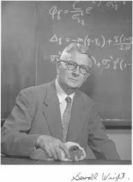
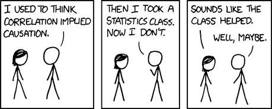

```{r setup, include = FALSE, message=FALSE}
library(ggplot2)
```


## Correlation does not imply

--

causation

--

always?

---

## Karl Pearson (1857-1936)

- Francis Galton demonstrates that one phenomenon -- regression to the mean -- is not caused by external factors, but merely the result of natural chance variation.

- Pearson (his student) takes this to the extreme, which is causation can never be proven.

"Force as a cause of motion is exactly on the same footing as a tree-god as a cause of growth." .small[(Pearson, 1892, pp 119)]

---

## Sewall Wright (1889-1988)

.pull-left[

]
.pull-right[
Geneticist; studied of guinea pigs at the USDA

Developed path models as a way to identify causal forces and estimate values

Rebuke from mathematical community, including from Ronald Fisher
  ]

---

## Judea Pearl

.pull-left[
- [Professor of computer science at UCLA](http://bayes.cs.ucla.edu/jp_home.html); studies AI

- Extensively studied this history of causation in statistics, inferring causality through data, and the development of path analysis

- Popularized the use of causal graph theory
]

.pull-right[

]

---

## Article: Rohrer (2018)

**Thinking clearly about correlation and causation: Graphical causal models for observational data**

Psychologists are interested in inherently causal relationships. 
  * e.g., how does social class cause behavior?
  
According to Rohrer, how have psychologists attempted to study causal relationships while avoiding issues of ethicality and feasibility?

--

It is impossible to infer causation from correlation without background knowledge about the domain. 
* Experimental studies require assumptions as well.

???
 "surrogate interventions" -- e.g., perceived social class with subjective ladder
 * these lack external validity
 Avoiding causal language
 * Doesn't stop lay persons or other researchers from inferring; also, maybe that's based in problematic assumptions
 Controlling for 3rd variables
 * How do we know what to control for?
 
---

## Directed Acyclic Graphics (DAGs)

* Visual representations of causal assumptions
* Share many features with structural equation models

There are many small differences between SEMs and DAGs, but this is the biggest: 
* SEMs are quantitative models -- they are used to estimate various parameters (think, several multiple regressions strung together)
* DAG models qualitative: you will not use a DAG model to estimate numeric values.
  * The benefit of DAG models is that they (1) help you clarify the causal model at the heart of your research question and (2) identify which variables you should and should **not** include in a regression model, based on your causal assumptions.
  
---

## Directed Acyclic Graphics (DAGs)

### Basic structures

* Boxes or circles represent constructs in a causal model -- these are called **nodes**.
* Arrows represent relationships. A &rarr; B

* Relationships can follow any functional form -- linear, polynomial, sinusoidal, etc. 

* DAGs only allow single-headed arrows; constructs cannot cause each other, nor can you cycle from a construct back to itself.

  * A &rlarr; B is not allowed; A &larr; U &rarr; B is
  * Constructs cannot cause themselves, so no feedback loops.  
  
---

```{r, message=F}
library(ggdag)

dag.obj = dagify(B ~ A)
ggdag(dag.obj)
```


---

## DAGs

**Paths** lead from one node to the next; they can include multiple nodes, and there may be multiple paths connecting two nodes. There are three kinds of paths:

* Chains
* Forks
* Inverted forks

---

## Paths: Chains


Chains have the structure 

A &rarr; B &rarr; C.

Chains can transmit associations from the node at the beginning to the node at the end, meaning that you will find a correlation between A and C. These associations represent *real* causal relationships.

```{r chain-plot, eval = F}
set.seed(1234)
dag.obj = dagify(edu ~ iq,
                 income ~ edu,
                 labels = c("edu" = "Edu",
                         "iq" = "Intel",
                         "income" = "Inc"))
ggdag(dag.obj, text = FALSE, use_labels = "label", 
      label_size = 25) + 
  theme_bw()
```

---

```{r, ref.label="chain-plot", echo = F}

```


---

## Paths: Forks

Forks have the structure 

A &larr; B &rarr; C.

Forks can transmit associations but they are not causal. They are the structure most relevant for the phenomenon of confounding

```{r fork-plot, eval = F}
set.seed(1234)
dag.obj = dagify(edu ~ iq,
                 income ~ iq,
                 labels = c("edu" = "Edu",
                            "iq" = "Intel",
                            "income" = "Inc"))
ggdag(dag.obj, text = FALSE, use_labels = "label", 
      label_size = 25) +
  geom_dag_text(nudge_y = -1) +
  theme_bw()
```

---

```{r, ref.label="fork-plot", echo = F}

```


---

## Paths: Inverted Forks

Inverted forks have the structure 

A &rarr; B &larr; C.

Inverted forks cannot transmit associations. In other words, if this is the true causal structure, there won't be a correlation between A and C. 

```{r ifork-plot, eval = F}
set.seed(1234)
dag.obj = dagify(income ~ edu,
                 income ~ iq,
                 labels = c("edu" = "Edu",
                            "iq" = "Intel",
                            "income" = "Inc"))
ggdag(dag.obj, text = FALSE, use_labels = "label", 
      label_size = 25) + 
  theme_bw()
```

---


```{r, ref.label="ifork-plot", echo = F}

```


---

## Complex paths

In reality, the causal pathways between the constructs in your model will be very complex. 

```{r complex, eval = F}
set.seed(1234)
dag.obj = dagify(gpa ~ iq,
                 edu ~ gpa + iq, 
                 income ~ edu + iq,
                 labels = c("edu" = "Edu",
                            "iq" = "Intel",
                            "gpa" = "Grades",
                            "income" = "Inc"))
```

```{r, eval = F, warning=FALSE, message=FALSE}
set.seed(1234)
ggdag(dag.obj, text = FALSE, use_labels = "label", 
      label_size = 25) + 
  theme_bw()
```
---

```{r, ref.label="complex", echo = F, warning=FALSE, message=FALSE}

```

```{r, echo = F}
ggdag(dag.obj, text = FALSE, use_labels = "label", 
      label_size = 25) + 
  theme_bw()
```


---

## Confounding

DAG models are most useful for psychological scientists thinking about which variables to include in a regression model. Recall that one of the uses of regression is to statistically control for variables when estimating the relationship between an X and Y in our research question. Which variables should we be statistically controlling for?

--

We can see with DAG models that we should be **controlling for constructs that create forks**, or a construct **causes both our X and Y variable**. These constructs are known as _**confounds**_, or constructs that represent common causes of our variables of interest. 

Importantly, we don't need to control for variables that causes just X and not Y (think of the issue of suppression).

---


```{r open, eval = F, highlight.code = 8}
set.seed(1234)
dag.obj = dagify(gpa ~ iq,
                 edu ~ gpa + iq, 
                 income ~ edu + iq,
                 labels = c("edu" = "Edu",
                            "iq" = "Intel",
                            "gpa" = "Grades",
                            "income" = "Inc"), 
                 exposure = "edu", outcome = "income")
ggdag_paths(dag.obj, text = FALSE, use_labels = "label")+
  theme_bw()
```

---

```{r ref.label = "open", echo = F, fig.width=10}

```

What should I control for?

---

```{r, fig.width=10}
ggdag_adjustment_set(dag.obj, text = FALSE, use_labels = "label") + theme_bw()
```

---

Confounds open "back-doors" between variables that act like causal pathways, but are not. By closing off the back doors, we isolate the true causal pathways, if there are any, and our regression models will estimate those. 

Based on the causal structure I hypothesized last slide, if I want to estimate how much education causes income, I should control for intelligence, but I don't need to control for grades. 

If you also controlled for grades, that would change the meaning of education. So you'd still get a causal effect of education on income, but it would be a different effect than what you might imagine (because we've partialled out grades & intelligence now). 

If we keep grades in, our question might be "does having higher grades lead to students wanting to continue on with schooling which in turn gets them higher incomes?"

If we control for grades, our question might be "if everyone has the same level of grades, then do those that choose more schooling earn more money?"
---

## More control is not always better

We can see with forks that controlling for confounds improves our ability to correctly estimate causal relationships. So controlling for things is good...

Except the other thing that DAGs should teach us is that controlling for the wrong things can dramatically hurt our ability to estimate true causal relationships and can create spurious correlations, or open up new associations that don't represent true causal pathways. 

Let's return to the other two types of paths, chains and inverted forks. 

---

## Control in chains

Chains represent mediation; the effect of construct A on C is *through* construct B.

Intelligence &rarr; Educational attainment &rarr; Income

What happens if we control for a mediating variable, like education?

```{r}
dag.obj = dagify(m ~ x,
                 y ~ m,
                 labels = c("x" = "Intel",
                            "m" = "Edu",
                            "y" = "Inc"), 
                 exposure = "x", outcome = "y")
```

---

.pull-left[
```{r}
ggdag_dseparated(dag.obj, 
                 text = FALSE, 
                 use_labels = "label") + 
  theme_bw()
```
]
.pull-right[
```{r}
ggdag_dseparated(dag.obj, 
                 controlling_for = "m", 
                 text = FALSE, 
                 use_labels = "label") +
  theme_bw()
```
]

--

Controlling for mediators removes the association of interest from the model -- you may be removing the variance you most want to study! It cuts off the flow of information from X to Y, so you wouldn't find a causal effect.

---


Inverted forks also teach us what not to control for: colliders. A **collider** for a pair of constructs is any third construct that is caused by both constructs in the pair. Controlling for (or conditioning on) these variables introduces bias into your estimates. 

Intelligence &rarr; Income attainment &larr; Educational

What happens if we control for the collider?

```{r}
dag.obj = dagify(c ~ x,
                 c ~ y,
                 labels = c("x" = "Intel",
                            "c" = "Inc",
                            "y" = "Edu"), 
                 exposure = "x", outcome = "y")
```


---

.pull-left[
```{r}
ggdag_dseparated(dag.obj, 
                 text = FALSE, 
                 use_labels = "label") + 
  theme_bw()
```
]
.pull-right[
```{r}
ggdag_dseparated(dag.obj, 
                 controlling_for = "c", 
                 text = FALSE, 
                 use_labels = "label") + theme_bw()
```
]

Edu and Intel are not related to one another *causally* (left). However, if you control for income, you now see a spurious relationship between edu and intel

???
(ie we lived in socialist obamaland, then the more intelligent would go to more schooling, but if we live in capitalist trumpland intelligence and edu are not related because the smart ones who need money can get it without extra schooling like us phd suckers). 

We get at the original question based on theory. Do the more intelligent undergo more schooling? Then by specifying a dag you can tell what variables you should and should not control for if you want to address your causal q. Of course in reality the questions are so much more complex and reality is more complex than this so it is hard to come up with a good dag. 
---


## Collider bias

### Unexpected colliders

Missing data or restricted range problems arise in collider bias.

```{r}
dag.obj = dagify(c ~ x,
                 c ~ y,
                 labels = c("x" = "Respitory Disease",
                            "c" = "Hospitalization",
                            "y" = "Locomotor Disease"), 
                 exposure = "x", outcome = "y")
```


---

.pull-left[

Sampling from a specific environment (or a specific subpopulation) can result in collider bias. 

Be wary of: 

* Missing data
* Subgroup analysis
* Any post treatment variables


This will extend to not just controlling for constructs, but estimating interactions with them. If your moderating variable is a collider, you've introduced collider bias. 

]
.pull-right[
```{r}
ggdag_dseparated(dag.obj, 
                 controlling_for = "c", 
                 text = FALSE, 
                 use_labels = "label") + theme_bw()
```
]

.small[Sackett et al. (1979)]

---

## Example

A health researcher is interested in studying the relationship between dieting and weight loss. She collects a sample of participants, measures their weight, and then asks whether they are on a diet. She returns to these participants two months later and assess weight again. What should the researcher control when assessing the relationship between dieting and weight loss?

---

```{r}
dag.obj = dagify(diet ~ wi,
                 wf ~ diet + wi,
                 loss ~ wi + wf,
                 labels = c("diet" = "Diet",
                            "wi" = "Initial Weight",
                            "wf" = "Final Weight",
                            "loss" = "Weight loss"), 
                 exposure = "diet", outcome = "loss")
```

---

```{r, fig.width=10}
ggdag_paths(dag.obj, text = FALSE, use_labels = "label") + theme_bw()

```

---

```{r, fig.width=10}
ggdag_adjustment_set(dag.obj, text = FALSE, use_labels = "label") + theme_bw()
```

---

What should be controlled here?

```{r, fig.width = 10, echo = F}
dag.obj = dagify(
  X ~ A,
  B ~ A + D,
  E ~ X + D,
  C ~ B,
  Y ~ E,
  exposure = "X", outcome = "Y"
)
ggdag(dag.obj) + theme_bw()
```
---


```{r, fig.width=10}
ggdag_adjustment_set(dag.obj) + theme_bw()
```
---
There is a **strong** assumption of DAG models, and that it's that no relevant variables have been omitted from the graph and that causal pathways have been correctly specified. This is a tall order, and potentially impossible to meet. Moreover, two different researchers may reasonably disagree with what the true model looks like. 

It's your responsibility to decide for yourself what you think the model is, provide as much evidence as you can, and listen with an open mind to those who disagree. 



<!-- --- -->

<!-- Correlation can imply causation, provided the appropriate temporal precedence is considered and the correct number and specification of third-variable causes has been included in the model. -->